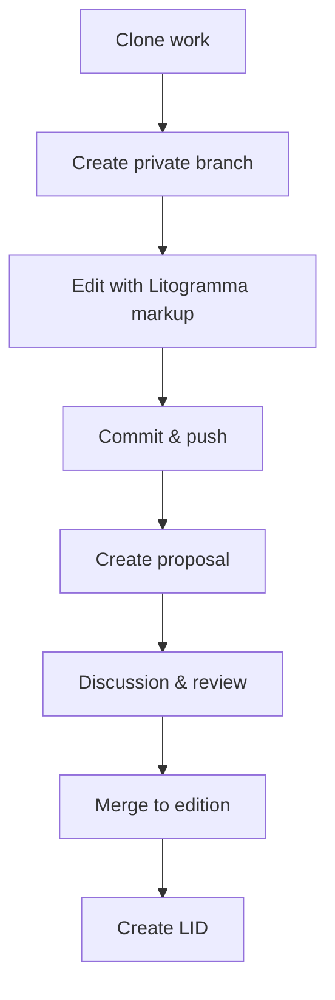

# Litodex — Version Control for Humanity's Texts

Litodex is a platform for version-controlled, verified, and collaborative management of literary and sacred texts. It provides permanent identifiers, scholarly workflows, and a foundation for applications like the Litogram typing practice app.

## Core Philosophy

- **One work = one repository** — not per edition, not per user
- **Editions = branches** — multiple authoritative versions coexist
- **No single master** — scholarship has no single source of truth
- **Manuscripts are first-class** — `ms/` branches alongside editions
- **Permanent identifiers** — every snapshot gets a citable LID
- **Lightweight markup** — Litogramma annotations make parsing trivial

## Repository Structure

Every text repository follows this pattern:

```
{lang}/{author}-{work}.git
```

Example: `grc/homer-iliad.git`

### Branch Hierarchy

| Prefix | Latin | Purpose | Protection |
|--------|-------|---------|------------|
| `meta` | *meta* | Work metadata (single file) | 🔒 Owner only |
| `ed/` | *editio* | Public authoritative editions | 🔒 Maintainers |
| `ms/` | *manuscriptum* | Source manuscripts | 🔒 Curators |
| `collab/` | *collaboratio* | Group projects | 🔒 Team |
| `priv/` | *privatus* | Personal workspace | ❌ Owner |
| `prop/` | *propositum* | Proposed changes | ❌ Anyone |
| `rev/` | *recensio* | Review branches | ⚠️ Temporary |
| `arch/` | *archivum* | Archived branches | 🔒 Read-only |

### The Meta Branch

Every repository has a `meta` branch containing a single `meta.toml` file:

```toml
[work]
id = "grc/homer-iliad"
title = "Iliad"
author = "Homer"
language = "grc"
type = "poetry"

# Optional
period = "8th century BCE"
description = "Ancient Greek epic poem"
license = "public-domain"
```

This branch is created at initialization and never deleted. It establishes the work's identity independent of any content branch.

## Litogramma Markup

(Atrep dialektos)

## Permanent Identifiers (LIDs)

Every important snapshot gets a **Litodex Identifier** — a permanent, citable URL.

### Format

```
{lang}/{author}/{work}/{branch}/{date}
```

Example: `grc/homer/iliad/ed/oxford-1920/20250101`

### Resolution

```
https://lid.litodex.org/grc/homer/iliad/ed/oxford-1920/20250101
```

Redirects to the exact commit snapshot. LIDs are stored as Git tags:

```
refs/tags/lid/grc/homer/iliad/ed/oxford-1920/20250101
```

### Creating a LID

```bash
$ lit lid create --date=2025-01-01
LID: grc/homer/iliad/ed/oxford-1920/20250101
Permanent snapshot created.
```

## The `lit` CLI

### Getting Started

```bash
# Install
curl -sSL https://litodex.org/install | bash

# Initialize a new work
$ lit init grc/homer-iliad --author="Homer" --title="Iliad"

# Clone existing work
$ lit clone litodex.org/grc/homer-iliad
$ cd homer-iliad
```

### Daily Work

```bash
# See what's available
$ lit branch --list
  ed/oxford-1920
  ed/teubner-1898
  ms/venetus-a
  priv/smith-experimental

# Start working
$ lit branch priv/smith-experimental --from=ed/oxford-1920
$ lit checkout priv/smith-experimental

# Edit (using Litogramma markup)
$ vim venetus-a.txt

# Commit
$ lit commit -m "Correxi errorem in linea 47"
$ lit push
```

### Proposing Changes

```bash
# Create proposal branch
$ lit branch prop/smith-1.47-correction --from=priv/smith-experimental
$ lit push origin prop/smith-1.47-correction

# Request merge
$ lit request-merge prop/smith-1.47-correction --into=ed/oxford-1920
```

### Working with Versions

```bash
# List versions (LIDs)
$ lit lid list
grc/homer/iliad/ed/oxford-1920/20250101
grc/homer/iliad/ed/oxford-1920/20250315

# Show specific version
$ lit show grc/homer/iliad/ed/oxford-1920/20250101 --verse=1.47

# Compare versions
$ lit diff grc/homer/iliad/ed/oxford-1920/20250101 \
           grc/homer/iliad/ed/oxford-1920/20250315 \
           --verse=1.47

# Cite version
$ lit cite grc/homer/iliad/ed/oxford-1920/20250101 --format=bibtex
```

### Metadata

```bash
# View work metadata
$ lit meta
Repository: grc/homer-iliad
Title: Iliad
Author: Homer
Language: grc (Ancient Greek)
Type: poetry

# Edit (requires special permission)
$ lit meta edit --description="Updated description"
```

### Branch Management

```bash
# List branches with details
$ lit branch --list --verbose
  ed/oxford-1920 (protected, 127 commits)
  priv/smith-experimental (your workspace, 3 commits)
  prop/smith-1.47-correction (open proposal)

# Archive old branches
$ lit branch archive --older-than=1y --prefix=priv/

# Clean up merged proposals
$ lit branch prune --merged
```

## Architecture

### Storage
- **One Git repository per work**
- All branches (editions, manuscripts, personal) in same repo
- `meta` branch for work identity
- LIDs stored as Git tags

### Indexing (Optional, for performance)
- SQLite index for fast semantic queries
- Rebuilt from Git on demand
- Stores reference → line → word mappings

### Parsing
- Litogramma markup makes parsing trivial
- No heuristics — users provide structure via `// ref`
- Word boundaries via Unicode segmentation

### Resolution Service
- `lid.litodex.org/{lid}` → permanent redirects
- Backed by Git tags, no database needed
- Returns HTTP 302 to canonical URL

## Workflows

### For Scholars



### For Students
1. Professor shares LID: `grc/homer/iliad/ed/oxford-1920/20250101`
2. Student enters LID → exact text
3. Practice on Litogram
4. All using same verified version

### For Publishers
1. Prepare critical edition
2. Upload to Litodex as `ed/publisher-year`
3. Create LID
4. Include LID in print edition
5. Readers access digital version

## Community Guidelines

### Branch Naming
- `priv/username-description` — personal workspaces
- `prop/username-description` — proposals
- `collab/institution-project` — collaborative projects

### Protection Rules
- `ed/` branches require maintainer approval
- `ms/` branches require curator verification
- `meta` branch is immutable after work identity established
- Private branches auto-archive after 1 year
- Proposals auto-archive 3 months after merge/rejection

### Abuse Prevention
- Rate limiting: max 5 private branches per user per work
- Automatic archiving of inactive branches
- Manual pruning for abuse (reversible)

## Integration with Litogram

Litodex provides the verified texts; Litogram provides the practice:

```typescript
// litogram.org backend
async function getText(lid: string) {
    const { content, metadata } = await fetch(`https://api.litodex.org/v1/resolve/${lid}`);
    return {
        typing: strip_markup(content),      // 🌕 Full text
        memorizing: first_letters(content), // 🌗 First letters only
        reciting: blank_page(),              // 🌑 Blank page
        metadata
    };
}
```

## Comparison with Git

| Git Concept | Litodex Concept |
|-------------|-----------------|
| `master` branch | (none — hidden) |
| Branch | Edition or manuscript |
| Tag | LID (permanent snapshot) |
| Fork | Private branch |
| Pull request | Proposal branch |
| Merge | Scholarly synthesis |
| Commit | Version |
| Remote | Another repository |

## Why Litodex?

- **For scholars**: Permanently citable versions, collaborative workflows, manuscript tracking
- **For students**: Verified texts, Litogram integration, citation-ready
- **For institutions**: Hosted collections, private repositories, custom branding
- **For humanity**: Preservation of cultural heritage with cryptographic provenance

## License

Litodex core is open source under the MIT License. Content licenses are determined by contributors.

---

**One platform. One community. Infinite texts.**
