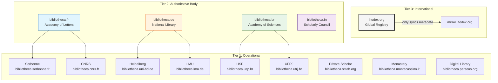
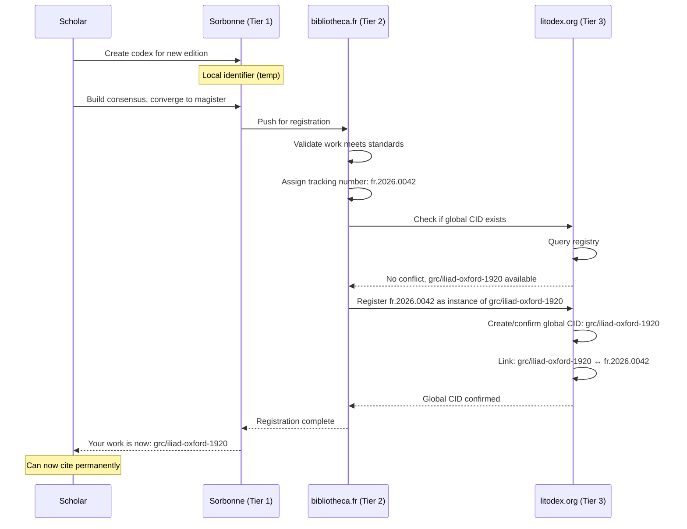
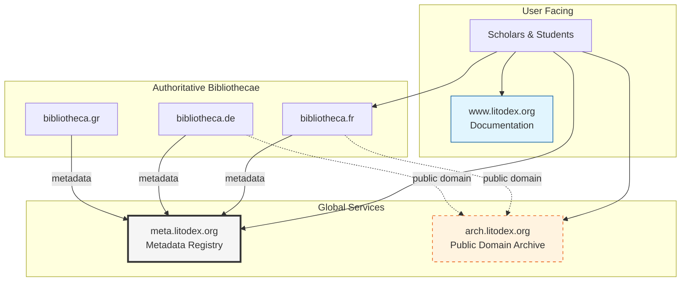
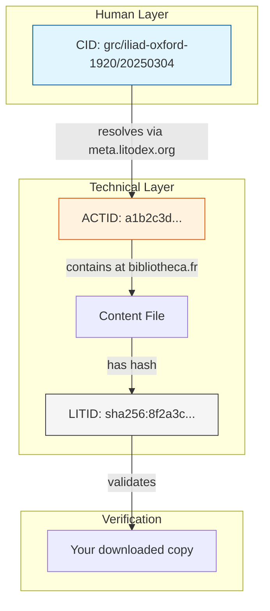

# Litodex — Version Control for Humanity's Texts

Litodex is a platform for version-controlled, verified, and collaborative management of literary and sacred texts. It provides permanent identifiers, scholarly workflows, and a foundation for applications like the Litogram typing practice app.

## System

The Litodex system is a combination of:
- Git: standard source control
- Litogramma: markup language achieving two things:
  - adapting Git's line-based atomicity to humanities for easy diffing
  - providing a canonical form suitable for deterministic hashing
- A workflow system with a tiered, federated distributed nodes called "bibliothecae" designed to produce authoritative, community consensus-based, versions of texts, substantiated by sourcing evidence

The Litodex system consists of two applications:
1. `lit`, ("humanities git") a standalone Rust binary that uses Git internally as its storage engine. Git is an **implementation detail hidden from the user** — users never run `git` commands directly. The repository format is opaque: `lit` uses a non-standard storage directory (not `.git`) to prevent accidental or intentional use of raw `git` commands that would bypass workflow restrictions. This hiding is intentional and necessary: it enforces branch-naming conventions, source metadata requirements, signing requirements, and convergence rules that raw Git would not enforce.
2. `litodex`, ("humanities GitHub", but open source and federated), a server with user management, GPG signature management, and workflows

### What Lives Where

**In Git (managed by `lit` CLI):**
- Text content (the actual literary/sacred texts)
- Source metadata (in commit trailers)
- Convergence history (the commit graph)
- Versiones (annotated tags)

**In the bibliotheca server (managed by `litodex` server):**
- User accounts and authentication
- Certificate/key management (including Tier 2-issued custos keys)
- Role and permission assignments (curator, custos)
- Voting records and consensus state
- Federation peering and sync configuration
- Works database (registry of abstract works — title + author — linking related editions)

The `lit` CLI talks to Git for content operations and to the bibliotheca server API for user, role, and voting operations.

## Core Philosophy

- **One edition = one codex** — each concrete edition (and each manuscript) gets its own codex
- **Magister = consensus** — each codex converges toward a single authoritative text through community agreement
- **Sources are sacred** — every change must be traceable to a verifiable source
- **Consensus-driven** — public editions emerge from community agreement, not maintainer fiat
- **Deterministic content-derived identifiers** — every .lit file has a hash-derived LITID
- **Citable references** - every version gets a CID - a human-friendly ISBN-like reference (e.g., `grc/iliad-oxford-1920/20260101`)
- **Lightweight markup** — Litogramma annotations make parsing trivial
- **Federated by design** — no central control, multiple sovereign nodes

## Core Terminology

| Git | Litodex (Formal) | Litodex Alias | When to Use |
|-----|------------------|---------------|-------------|
| **repository** | codex | (none) | `lit codex init`, `lit codex list` |
| **root branch** | radix | (none) | Special stemma with `meta.toml` |
| **branch** | stemma | `sm` | Any textual tradition |
| **tag** | versio | `ver` | Frozen snapshot with date |
| **commit** | actum | `act` | Recorded change |
| **log** | historia | `hist` | History of acts |
| **diff** | delta | `delta` | Difference (Δ) |
| **status** | status | `st` | Current state |
| **merge** | convergere | `con` | Combine proposals into a stemma |

## The Bibliotheca Federation

Litodex is not a single service but a **federation of sovereign nodes** called **bibliothecae** (singular: bibliotheca). Each bibliotheca is an independent server running the Litodex software, configured for its role in the scholarly ecosystem.

### The Three-Tier Hierarchy



### Tier Definitions

| Tier | Type | Acts Enabled? | Can Issue CIDs? | Primary Function |
|------|------|---------------|-----------------|------------------|
| 1 | Operational | ✅ YES | ❌ NO | Create content, build consensus |
| 2 | Authoritative Body | ❌ NO | ✅ YES | Validate, preserve, issue administrative tracking numbers |
| 3 | International | ❌ NO | ✅ YES | Sync, detect conflicts, confirm global CIDs |

#### Key Insight
**Tier 2 and Tier 3 run the exact same software** — just with different configurations and peer relationships. The only difference is what they peer with.

---

## Tier 1: Operational Bibliothecae

**Who:** Universities, research institutions, private scholars, monasteries, museums, digital libraries

**What they do:**
- Create and modify content (`act`, `prop`, `priv`)
- Host their own stemmata with full version control
- Build consensus within their community
- Push converged works to their authoritative bibliotheca
- Can peer directly with other Tier 1 for collaboration

### Technical Capabilities
- Full read/write access to their own stemmata
- Can host both public and private works
- Responsible for their own authentication
- Must peer with their authoritative bibliotheca (but can also peer with others)
- **Cannot issue CIDs** — must request them from Tier 2

### Example Workflow

```bash
# A scholar at Sorbonne creates a codex for the Oxford 1920 edition
$ lit codex init grc/iliad-oxford-1920 \
  --bibliotheca=bibliotheca.sorbonne.fr

# Work lives locally at:
# https://bibliotheca.sorbonne.fr/grc/iliad-oxford-1920

# Build consensus, create the authoritative edition
$ lit sm create prop/iliad-oxford-xkm
$ lit act -m "Initial text" --source="..."
# ... discussion, voting ...
$ lit converge prop/iliad-oxford-xkm --into=magister

# When ready, push to the authoritative body
$ lit push national --to=bibliotheca.fr
Pushing magister/20250304 to authoritative bibliotheca...
Requesting registration from bibliotheca.fr...
```

Each bibliotheca chooses its own consensus model. The `[consensus]` block in the
local configuration file describes how convergence decisions are made:

```toml
# Example: supermajority vote (the Sorbonne's chosen model)
[consensus]
model = "supermajority"
threshold = 0.70          # 70% approval required

# Alternative: a single designated authority (BDFL)
# [consensus]
# model = "bdfl"
# authority = "@schmidt"

# Alternative: unanimity — every participant must approve
# [consensus]
# model = "unanimity"
```

These are illustrative examples; bibliothecae are free to define the model that
fits their scholarly community.

---

## Tier 2: Authoritative Bibliothecae

**Who:** Academies of Letters/Sciences, National Libraries, transnational scholarly societies (e.g., International Association of Buddhist Studies), regional consortia, or any recognized scholarly authority over a domain. The key property is recognized scholarly authority — not nationality.

**What they do:**
- **Receive** converged stemmata from Tier 1 institutions
- **Validate** that submissions meet their scholarly standards
- **Issue administrative tracking numbers** (e.g., `fr.2026.0042`) — these are internal registration numbers, not CIDs
- **Host** editions for long-term preservation
- **Never create content directly** — only receive from Tier 1
- **Sync metadata** with the international bibliotheca

### Technical Capabilities
- **Acts are disabled** — no direct commits
- **Administrative tracking** — can assign internal registration numbers
- **Sync with Tier 1** (institutional bibliothecae)
- **Sync with Tier 3** (international bibliotheca)
- Maintains provenance of all received works

### Configuration Example

```toml
# /etc/litodex/bibliotheca.fr.toml
[server]
name = "Bibliotheca Nationalis Franciae"
domain = "bibliotheca.fr"
tier = 2

[capabilities]
acts_enabled = false  # Cannot create content
cid_issuance = true    # Can issue global CIDs (after Tier 3 confirmation)
sync_enabled = true    # Can sync with peers

[peers]
# Tier 1 institutions that feed into this authoritative bibliotheca
tier1 = [
  "https://bibliotheca.sorbonne.fr",
  "https://bibliotheca.cnrs.fr",
  "https://bibliotheca.college-de-france.fr"
]

# Tier 3 peer (only one)
tier3 = "https://litodex.org"

[tracking]
# Internal administrative namespace (not part of CIDs)
namespace = "fr"
pattern = "{namespace}.{year}.{sequential}"  # e.g., fr.2026.0001

[sync]
# Push metadata to Tier 3 immediately
push_to_tier3 = true
# Check for conflicts daily
conflict_check_interval = "24h"
```

### What an Authoritative Bibliotheca Stores

```bash
$ ls -la /var/lib/bibliotheca.fr/grc/
drwxr-xr-x  iliad-oxford-1920/
drwxr-xr-x  iliad-cnrs-1998/
-rw-r--r--  provenance.toml

$ cat iliad-oxford-1920/provenance.toml
[work]
id = "grc/iliad-oxford-1920"
tracking_id = "fr.2026.0042"   # Internal administrative number — NOT a CID
global_cid = "grc/iliad-oxford-1920"  # Confirmed by Tier 3

[instances]
sorbonne-20250304 = {
  source = "bibliotheca.sorbonne.fr/grc/iliad-oxford-1920/magister/20250304",
  validated = "2026-03-05",
  validator = "Académie des Inscriptions et Belles-Lettres",
  validation_notes = "Meets French scholarly standards for critical editions"
}

$ cat iliad-cnrs-1998/provenance.toml
[work]
id = "grc/iliad-cnrs-1998"
tracking_id = "fr.2026.0051"   # Separate edition, separate codex, separate tracking number
global_cid = "grc/iliad-cnrs-1998"

[instances]
cnrs-20250301 = {
  source = "bibliotheca.cnrs.fr/grc/iliad-cnrs-1998/magister/20250301",
  validated = "2026-03-02",
  validator = "Académie des Sciences",
  validation_notes = "Diplomatic transcription, apparatus complete"
}
```

### A Note on Authoritative Bodies

The Tier 2 role is defined by recognized scholarly authority over a domain — not by geography. A national academy, a transnational scholarly society such as the International Association of Buddhist Studies, or a regional consortium can all serve as Tier 2. For traditions without any representative Tier 2 institution, Tier 3 (`litodex.org`) coordinates by detecting conflicts and notifying parties — but never resolves them.

For nations or regions without Tier 2 infrastructure, Tier 1 institutions sync directly with Tier 3. This is not a failure of the model but the federation adapting to the scholarly landscape.

```toml
# Example: institution syncing directly with Tier 3 (no Tier 2 available)
[peers]
# No tier2 entry — sync directly with the international registry
tier3 = "https://litodex.org"
```

---

## Tier 3: International Bibliotheca (litodex.org)

**Who:** A lightweight coordinating body — the global registry

**What they do:**
- **Maintain the global CID registry** (which works exist, their canonical names)
- **Sync metadata** across all authoritative bibliothecae
- **Detect identifier conflicts** when two bodies use the same CID for different works
- **Never store content** — only metadata and pointers
- **Never exercise power** — conflicts are returned to the parties involved
- **Confirm global CIDs** after checking for conflicts

### Technical Capabilities
- **Acts are disabled** — no content, ever
- **CID issuance is enabled** — confirms global identifiers
- **Sync with all Tier 2** bibliothecae
- **Conflict detection** (automatic)
- **Conflict resolution** (human-mediated, never automatic)

### Configuration Example

```toml
# /etc/litodex/litodex.org.toml
[server]
name = "Litodex Internationalis"
domain = "litodex.org"
tier = 3

[capabilities]
acts_enabled = false     # Cannot create content
cid_issuance = true      # Can confirm global CIDs
sync_enabled = true      # Sync with all Tier 2

[peers]
# All authoritative bibliothecae
tier2 = [
  "https://bibliotheca.fr",
  "https://bibliotheca.de",
  "https://bibliotheca.it",
  "https://bibliotheca.gr",
  "https://bibliotheca.br",
  "https://bibliotheca.in",
  "https://bibliotheca.cn",
  "https://bibliotheca.eg",
  "https://bibliotheca.il",
  # ... all others
]

[cid]
# Global namespace (no prefix)
namespace = "global"
pattern = "{lang}/{title}-{publisher-or-edition}-{year}"  # codex identifier, e.g., grc/iliad-oxford-1920
                                                          # full CID with versio: grc/iliad-oxford-1920/20250304

[sync]
# Pull from all Tier 2 every hour
pull_interval = "1h"
# Immediately flag conflicts
conflict_detection = "immediate"
# Never resolve conflicts automatically
auto_resolve = false
```

### The Global Registry Data Model

The full registry data model — including `instances`, `archived_instances`, and copyright fields — is defined in the `meta.litodex.org` service. See [The Litodex Service Ecosystem](#the-litodex-service-ecosystem) for the canonical JSON schema.

---

## The CID Issuance Flow



---

## Conflict Detection and Resolution

The international bibliotheca's **only power** is to detect conflicts and notify the parties involved.

### The Conflict Detector

The conflict-detection logic is implemented in `meta.litodex.org`. See [The Litodex Service Ecosystem](#the-litodex-service-ecosystem) for the canonical `GlobalRegistry` class.

### Real Conflict Example

```bash
# Two bodies try to register the same CID simultaneously
$ litodex.org/logs/2026-03-04.log

10:32:15 [CONFLICT] Detected simultaneous reservation
  CID: "san/buddhacharita-johnston-1936"
  
  Reservation 1: bibliotheca.in (India)
    Work: "Buddhacarita by Ashvaghosha (Johnston 1936 edition)"
    Evidence: "Critical edition based on Sanskrit manuscripts"
  
  Reservation 2: iabs.bibliotheca.org (International Association of Buddhist Studies)
    Work: "Buddhacarita (Sanskrit-Tibetan parallel edition, 1936)"
    Evidence: "Taisho Tripitaka edition with Tibetan commentary"
  
  These appear to be different recensions of related but distinct texts.

10:32:16 [ACTION] Notified both parties
  To: bibliotheca.in, iabs.bibliotheca.org
  Subject: CID conflict: san/buddhacharita-johnston-1936
  
  "Both of you have reserved this CID for what appear to be
  different works. Please communicate and decide among yourselves:
  
  - One of you keeps the CID, the other chooses a different one
  - You agree to share the CID with clear attribution
  - You request hierarchical CIDs
  
  litodex.org has no opinion. We await your consensus."

10:48:03 [RESOLUTION] Received from both parties
  "We have agreed:
   - bibliotheca.in will use san/buddhacharita-johnston-1936 for the Sanskrit version
   - iabs.bibliotheca.org will use san/buddhacharita-tibetan-1936 for the parallel edition
   - Both CIDs will cross-reference each other in metadata"
  
  Registry updated.
```

---

## Roles (Per Bibliotheca)

Each bibliotheca maintains its own roles independently. A scholar may be a curator at their university, a custos at the authoritative level, and have no role internationally.

| Role | Latin | Responsibility | Level |
|------|-------|----------------|-------|
| **Curator** | *curator* | Maintains radix stemma (metadata) | Any |
| **Custos** | *custos* | Facilitates consensus for the magister stemma | Any |

### Curator (at any level)

The curator maintains the **radix** — the root stemma containing only `meta.toml`.

```bash
# At institutional level
$ lit cur list --bibliotheca=bibliotheca.sorbonne.fr
Curatores for grc/iliad-oxford-1920:
  @smith (since 2026-01-15)
  @jones (since 2026-02-20)

# At authoritative level (Tier 2, though acts disabled)
$ lit cur list --bibliotheca=bibliotheca.fr
Curatores for authoritative metadata:
  @dupont (Académie des Inscriptions)
  @martin (Bibliothèque Nationale)
```

### Custos (at any level)

The **custos** serves the consensus within their bibliotheca.

```bash
$ lit cus list --bibliotheca=bibliotheca.uni-hd.de
Custodes for grc/iliad-heidelberg-1998:
  @schmidt → magister
```

A custos:
- Manages convergence according to the bibliotheca's own configured consensus model
- Facilitates discussion and, where applicable, voting
- **Verifies source integrity** before convergence (a Litodex-level requirement regardless of consensus model)
- Executes convergences only when the bibliotheca's configured rules are satisfied

Custos governance is an **organizational matter**. Some institutions may have a committee acting as custos — technically, one person always holds the certificate and signs, but the decision-making process behind that signature is up to the institution. Custos succession is also organizational: when a custos leaves, the institution requests a new key from Tier 2 and the new custos continues.

#### The Custos Dashboard

```bash
$ lit custos dashboard --stemma=magister
Custos dashboard for magister

Current version: magister/20250401

Open proposals:
  prop/iliad-oxford-tyr (92% approve, sources: 3/3 verified) → ready to converge
  prop/iliad-oxford-wlm (63% approve, sources: 5/5 verified) → needs discussion
  prop/iliad-oxford-zab (41% approve, sources: 2/4 verified) → weak support, missing sources

Recent convergences:
  2025-04-01: converged prop/iliad-oxford-jqr (apparatus)
  2025-03-15: converged prop/iliad-oxford-tyr (line 102)
  2025-03-04: created magister from 3 proposals

Consensus model: supermajority (70% approve, configured locally), all sources must be verified
```

## Signing and Trust

Every act in Litodex must be signed with a GPG or SSH key. Signatures provide accountability, but their role differs between local and federated trust.

### The Trust Chain

```
Tier 2 (authoritative bibliotheca)
  └── issues keys to custodes
        └── custos signs convergence acts
              └── Tier 2 verifies its own issued key
```

- **Individual act signatures** provide local accountability within a Tier 1 bibliotheca — they track who contributed what and deter tampering.
- **`prop/` branches are always squash-merged** into the target stemma when converged. This collapses the individual act signatures into a single convergence act.
- **Only the custos signs the convergence act.** This is the signature that matters for upstream trust. When a Tier 1 bibliotheca pushes to its authoritative Tier 2, only this single signature needs to be verified.

### Key Issuance and Revocation

Tier 2 issues keys to custodes at Tier 1 institutions. A custos at the Sorbonne, for example, holds a key issued by `bibliotheca.fr` — not by the Sorbonne itself — that certifies them as a recognized custos in the French scholarly network.

```
1. Custos requests a key from their authoritative bibliotheca (Tier 2)
2. Tier 2 verifies the scholar's role at their institution
3. Tier 2 issues a signed certificate binding the scholar's public key
   to their custos role
4. The custos uses this key to sign all convergence acts
5. When Tier 1 pushes to Tier 2, the authoritative bibliotheca verifies
   a signature it issued itself — no cross-institutional trust needed
```

If a custos leaves or is otherwise revoked, the Tier 2 bibliotheca revokes the key. All future convergence acts from that custos will fail verification, protecting the integrity of the upstream record.

### Why Squash-Merging Makes This Work

Because `prop/` branches are always squash-merged, the entire history of individual acts — with their many different author signatures — is collapsed into one signed convergence act. Tier 2 does not need to trust every scholar who contributed to a proposal; it only needs to trust the custos who certified the result. This keeps the verification model simple and the trust surface small.

Individual act signatures remain in the local history at the Tier 1 bibliotheca for local accountability and auditing — they are simply not required for federation trust.

## Repository Structure

### One Edition = One Codex

Each concrete edition gets its own codex. The naming pattern is:

```
{lang}/{title}-{publisher-or-edition}-{year}
```

Examples:
- `grc/iliad-oxford-1920` — Homer's Iliad, Oxford Classical Texts, 1920
- `grc/iliad-teubner-1998` — Homer's Iliad, Teubner edition, 1998
- `san/buddhacharita-johnston-1936` — Buddhacarita, Johnston edition, 1936

Manuscripts are also their own codices:
- `grc/iliad-venetus-a` — Venetus A manuscript (diplomatic transcription)
- `grc/iliad-townley` — Townley manuscript

Author is optional in the codex name — many works have unknown or disputed authorship.

### Works Database

Each bibliotheca maintains a **works database** — a registry above the codex level that tracks abstract works (title + author). This is stored in the bibliotheca server, alongside user accounts, voting records, and federation configuration. It is not stored in Git.

The works database is the grouping mechanism that explains how `grc/iliad-oxford-1920`, `grc/iliad-teubner-1998`, and `grc/iliad-venetus-a` are all editions of the same underlying work ("Homer's Iliad").

```
Works Database (bibliotheca-level)                 Codices
┌──────────────────────────────────┐
│ Homer, Iliad                     │ ──→  grc/homer-iliad-oxford-1920
│                                  │ ──→  grc/homer-iliad-teubner-1998
│                                  │ ──→  grc/homer-iliad-venetus-a
├──────────────────────────────────┤
│ Ashvaghosha, Buddhacarita        │ ──→  san/buddhacharita-johnston-1936
├──────────────────────────────────┤
│ (unknown), Beowulf               │ ──→  ang/beowulf-klaeber-1950
└──────────────────────────────────┘
```

When a new codex is created, `lit` checks the bibliotheca's works database for a matching title + author:
- **Found** → the new codex is linked to the existing work record
- **Not found** → a new work record is created automatically

```bash
$ lit codex init grc/iliad-teubner-1998 \
  --title="Iliad" \
  --author="Homer" \
  --edition="Teubner 1998"

Checking works database...
✓ Found existing work: "Homer, Iliad" (2 other editions registered)
  Linked to work record.

Codex grc/iliad-teubner-1998 created.
```

The works database syncs upstream: Tier 2 maintains its own works database aggregated from all its Tier 1 institutions, and Tier 3 maintains the global one. This is how "related editions" are discoverable across the federation.

### Stemma Hierarchy

| Prefix | Latin | Purpose | Protection |
|--------|-------|---------|------------|
| `radix` | *radix* | Root stemma — `meta.toml` only | 🔒 Curators only |
| `magister` | *magister* | The single authoritative text | 🔒 Custos-facilitated |
| `prop/` | *propositum* | Proposals targeting magister | ❌ Anyone (institutional policy) |
| `priv/` | *privatus* | Personal workspace | ❌ Owner only |
| `collab/` | *collaboratio* | Group projects / shared workspace | 🔒 Configurable (institution) |

### The `collab/` Stemma

A `collab/` stemma is a shared workspace for group projects within a Tier 1 bibliotheca:

- **Created by** any user at a Tier 1 bibliotheca (subject to bibliotheca policy)
- **Access** is institution-configured: read-only for all, writable for all, or restricted to a named team
- **Purpose**: shared workspace for collaboration before promoting work to `prop/` and eventually `magister`
- **Scope**: only exists at Tier 1 — `collab/` stemmata never flow upstream

The natural scholarly progression is:

```
priv/  →  collab/  →  prop/  →  magister
```

Not every step is mandatory. A scholar can go straight from `priv/` to `prop/`, or create a `prop/` directly without any prior personal or collaborative workspace.

### The Radix Stemma

Every codex has a `radix` stemma containing only `meta.toml`:

```toml
# meta.toml
[work]
id = "grc/iliad-oxford-1920"
title = "Iliad (Oxford Classical Texts)"
language = "grc"
type = "poetry"

# Optional
period = "8th century BCE"
description = "Ancient Greek epic poem, Oxford Classical Texts edition, 1920"
license = "public-domain"
```

The radix is:
- Created at initialization, never deleted
- Only editable by curators (for `meta.toml`)
- Automatically converged into all other stemmata when changed
- The source of truth for work identity

Merge conflicts on radix auto-convergence are impossible: the radix contains only `meta.toml`, and no other stemma independently modifies `meta.toml` — it is always received from the radix. Auto-convergence is therefore always clean.

```bash
$ lit sm show radix
Stemma: radix (PROTECTED)
Type: root stemma
Curators: @smith, @jones
Contains: meta.toml
Acts: 3 (last: a1b2c3d "Updated description")
Auto-converges to: all stemmata
```

### Source Provenance

Source data is stored as structured trailers in commit messages. The `lit sources` command extracts and rebuilds source information by walking commit history:

```bash
$ lit sources grc/iliad-oxford-1920 --stemma=magister
Sources for magister (grc/iliad-oxford-1920):

Act a1b2c3d: "Base text from Archive.org scan"
  📄 Archive.org scan (digital)
  URL: https://archive.org/details/homeriilias00home
  Hash: sha256:def456... ✓ verified
  Conversion: litogramma-v1

Act e4f5g6h: "Corrected accent in line 102"
  📚 Monro (1897), p. 23 (print)
  Mediator: @smith

Act i7j8k9l: "Added apparatus note"
  📜 Venetus A, fol. 47r (manuscript)
  Mediator: @jones
```

### Retractions and Corrections

Retractions and corrections are handled by extending history with a reverting commit — never by rewriting history. The full record of what was published and what was subsequently corrected is always preserved.

## The `magister` Stemma

### Definition

The `magister` stemma is the single authoritative text within each codex. "Magister" is Latin for "the authoritative one" — it avoids the loaded English connotations of "master branch." Every codex has exactly one `magister`.

`magister` is the convergence target for all `prop/` branches.

### The Proposal System

Proposals use random 3-letter IDs to avoid implying priority or order:

```
prop/{target-stemma-name}-{random-id}
```

Examples:
- `prop/iliad-oxford-xkm`
- `prop/iliad-oxford-jqr`

The random ID (consonant-vowel-consonant) ensures no proposal appears "first" or "more important." When 3-letter CVC IDs are exhausted for a given target, the system extends to 4 letters following a CVCV pattern (e.g., `prop/iliad-oxford-xkma`).

Management of `prop/` stemmata — archiving, cleanup, and access control for who can create proposals — is entirely an **institutional matter** at Tier 1. Only the `magister` stemma flows upstream.

## The Source Requirement

**Every act in a `prop/` stemma must be traceable to a source.** This creates an auditable chain of evidence.

### Source Types

```toml
# Digital sources (automatically verifiable)
[source.type.digital]
url = "https://..."           # Source URL
hash = "sha256:abc123..."     # Content hash for verification
conversion_pipeline = "litogramma"  # The markup conversion used

# Print sources (require human mediation)
[source.type.print]
citation = "West, M.L. (1998). Homerus: Ilias. Vol. I. Stuttgart: Teubner. p. 47"
mediator = "@scholar"         # Who verified this source
verification_date = "2026-03-04"
note = "Personal examination of copy in Bodleian Library"

# Manuscript sources (physical or digital)
[source.type.manuscript]
identifier = "Venetus A"       # Common name
catalog = "Marc. Gr. Z. 454"   # Catalog number
library = "Biblioteca Nazionale Marciana, Venice"
folio = "47r"
line = "12"
image_url = "https://..."      # If digitized
```

---

## The Consensus Workflow (Tier 1)

### Phase 1: No Public Stemma Exists

Initially, only `radix` and personal stemmata exist:

```bash
$ lit sm list
grc/iliad-oxford-1920:
  radix
  magister
  prop/iliad-oxford-xkm   (proposed correction)
  prop/iliad-oxford-jqr   (another proposal)
  priv/smith-notes
  collab/seminar-2026      (shared workspace)
```

### Phase 2: Create Proposal with Sources

Scholars create proposal stemmata with embedded source metadata:

```bash
# Create a proposal with source metadata
$ lit prop create iliad-oxford-xkm \
  --target=magister \
  --source-type=digital \
  --source-url="https://archive.org/details/homeriilias00home" \
  --source-hash="sha256:def456..." \
  --pipeline="litogramma-v1" \
  --message="Base text from Archive.org scan, converted to Litogramma"

# Source metadata is stored as structured trailers in the commit message,
# for example:
#
#   Base text from Archive.org scan, converted to Litogramma
#
#   Source-type: digital
#   Source-url: https://archive.org/details/homeriilias00home
#   Source-hash: sha256:def456...
#   Source-pipeline: litogramma-v1
#   Source-verified-by: @smith
```

### Phase 3: Building on a Proposal

Subsequent acts must also cite sources:

```bash
# Make a change with source attribution
$ lit act -m "Corrected accent in line 102" \
  --source-type=print \
  --source-citation="Monro (1897). Homer: Iliad I-XII. Oxford. p. 23" \
  --source-mediator="@smith" \
  --source-note="Monro discusses this crux"
```

Each act can track multiple sources using structured commit trailers. When an act references more than one source, `lit` records each source as a numbered set of trailers:

```
Corrected accent in line 102

Source-type: print
Source-citation: Monro (1897). Homer: Iliad I-XII. Oxford. p. 23
Source-mediator: @smith
Source-note: Monro discusses this crux

Source-type: manuscript
Source-identifier: Venetus A
Source-note: Confirmed reading on folio 47r
Source-mediator: @jones
```

The diff and the commit message together are sufficient to judge a proposal — the trailers provide the source provenance without requiring any separate metadata file.

### Viewing Proposal Sources

```bash
# Show all sources used in a proposal
$ lit prop sources iliad-oxford-xkm
Proposal: iliad-oxford-xkm
Target: magister

Initial source:
  📄 Archive.org scan (digital)
  URL: https://archive.org/details/homeriilias00home
  Hash: sha256:def456... ✓ verified
  Conversion: litogramma-v1

Act a1b2c3d: "Corrected accent in line 102"
  📚 Monro (1897), p. 23 (print)
  Mediator: @smith
  Note: "Monro discusses this reading"

Act e4f5g6h: "Added apparatus note"
  📜 Venetus A, fol. 47r (manuscript)
  Mediator: @jones
  Image: https://.../venetus-a/47r.jpg
```

### The Radix Auto-Convergence

When curators update the radix:

```bash
$ lit sm checkout radix
$ vim meta.toml
$ lit act -m "Updated license to CC-BY"

# Automatically converges to ALL stemmata
$ lit act show a1b2c3d
Actum: a1b2c3d
Stemma: radix
Message: "Updated license to CC-BY"

Auto-converged to:
  ✓ magister (convergence act e4f5g6h)
  ✓ priv/smith-experimental (convergence act q3r4s5t)
  ✓ ...
```

Because the radix contains only `meta.toml` and no other stemma independently modifies it, auto-convergence is always clean — merge conflicts are impossible.

Metadata flows to all traditions automatically.

### Phase 4: Source Verification

Digital sources can be automatically verified:

```bash
# Verify a digital source
$ lit source verify https://archive.org/details/homeriilias00home \
  --hash="sha256:def456..." \
  --pipeline="litogramma-v1"

Verifying source...
Downloading... done
Computing hash... matches (def456...)
Converting to Litogramma... done
Validation: 0 errors, 2 warnings
  Warning: Line 47 missing verse number marker
  Warning: Line 103 has ambiguous line break

Source verified with warnings.
```

### Phase 5: Community Discussion and Voting

Scholars discuss, provide evidence, and vote:

```bash
$ lit prop vote prop/iliad-oxford-xkm --approve --reason="Matches manuscript evidence"
$ lit prop comment prop/iliad-oxford-xkm -m "See attached image of Venetus A folio 47r"

$ lit prop vote prop/iliad-oxford-jqr --reject --reason="Needs stronger evidence"
```

### Phase 6: Custos Verifies and Converges

When consensus is reached, the custos must verify all sources before converging:

```bash
$ lit consensus check prop/iliad-oxford-xkm --verify-sources
Checking consensus... 78% approve (local threshold met: supermajority ≥70%)
Checking sources...

Initial source: ✓ verified (hash matches)
Act a1b2c3d: ✓ source verified (print citation accepted)
Act e4f5g6h: ⚠️ manuscript image URL 404
  → Requires verification from mediator

Consensus met but source verification incomplete.
Cannot converge until all sources are verified.
```

After verification:

```bash
$ lit converge prop/iliad-oxford-xkm --into=magister
Converging prop/iliad-oxford-xkm into magister
Consensus confirmed: 78% approve (exceeds local threshold: supermajority ≥70%)
All sources verified: 12 digital, 8 print, 3 manuscript
Creating magister...
Convergence complete.

# A versio is automatically created with date suffix
$ lit ver list
magister/20250304   (first edition, includes xkm changes)
```

### Phase 7: Subsequent Corrections

Later, another scholar proposes a correction with proper sourcing:

```bash
# Create from an existing versio
$ lit prop create iliad-oxford-tyr \
  --from=magister/20250304 \
  --target=magister \
  --message="Correct line 102 based on manuscript evidence"

$ vim iliad.txt  # fix line 102
$ lit act -m "Corrected accent in line 102" \
  --source-type=manuscript \
  --source-identifier="Venetus A" \
  --source-folio="47r" \
  --source-library="Marciana" \
  --source-mediator="@smith"

# Discussion, voting, verification, convergence...
$ lit converge prop/iliad-oxford-tyr --into=magister
Converged. New versio: magister/20250315
```

### The Versio Timeline

```bash
$ lit ver list --stemma=magister
magister/20250304   (initial consensus edition)
magister/20250315   (correction to line 102)
magister/20250401   (added apparatus from jqr proposal)
magister/20250420   (further corrections)
```

Each versio is a frozen snapshot of community consensus at that point in time, with complete provenance tracking back to original sources.

---

## The `lit` CLI (Extended for Federation)

### Bibliotheca Management

```bash
# Configure your bibliotheca
$ lit config set bibliotheca https://bibliotheca.sorbonne.fr
$ lit config set national https://bibliotheca.fr

# Show federation status
$ lit federation status
Your bibliotheca: bibliotheca.sorbonne.fr (Tier 1)
Authoritative peer: bibliotheca.fr (Tier 2) - connected
International peer: litodex.org (Tier 3) - connected via authoritative

# List all known bibliothecae
$ lit federation list
Tier 1 (operational):
  - bibliotheca.sorbonne.fr
  - bibliotheca.cnrs.fr
  - bibliotheca.uni-hd.de
  
Tier 2 (authoritative):
  - bibliotheca.fr (peer)
  - bibliotheca.de
  - bibliotheca.it
  
Tier 3 (international):
  - litodex.org (connected)
```

### Pushing to the Authoritative Level

```bash
# Push an edition for registration
$ lit push national --versio=magister/20250304
Pushing to bibliotheca.fr...
Validation in progress...
✓ Meets scholarly standards
✓ Sources verified (12/12)
✓ Consensus documented

Assigned tracking number: fr.2026.0042 (internal administrative number)
Checking global registry...
Global CID confirmed: grc/iliad-oxford-1920

Your edition is now permanently citable as:
  https://bibliotheca.fr/grc/iliad-oxford-1920/20250304
  Global CID: grc/iliad-oxford-1920
```

### Resolving CIDs

```bash
# Resolve a global CID
$ lit resolve grc/iliad-oxford-1920
Found 1 registered instance:

1. France (tracking: fr.2026.0042)
   URL: https://bibliotheca.fr/grc/iliad-oxford-1920
   Latest versio: magister/20250420

# Note: fr.2026.0042 is an internal administrative tracking number,
# not a CID. The CID is grc/iliad-oxford-1920.

# Resolve a specific versio
$ lit resolve grc/iliad-oxford-1920/20250304
CID: grc/iliad-oxford-1920/20250304
ACTID: a1b2c3d7e8f9g0h1i2j3k4l5m6n7o8p9q0r1s2t3
LITID: sha256:8f2a3c7d9e1f5a6b2c3d4e5f6a7b8c9d0e1f2a3b
Bibliotheca: https://bibliotheca.sorbonne.fr
```

---

## Integration with Litogram

Litodex provides the verified texts; Litogram provides the practice:

```typescript
// litogram.org backend
async function getText(cid: string) {
    // Resolve CID through federation
    const instances = await resolveCID(cid);
    
    // Prefer authoritative instance or let user choose
    const selected = await selectInstance(instances);
    
    const { content, metadata, sources } = await fetch(selected.url);
    
    return {
        typing: strip_markup(content),      // 🌕 Full text
        memorizing: first_letters(content), // 🌗 First letters only
        reciting: blank_page(),              // 🌑 Blank page
        metadata,
        sources: formatCitation(sources),
        citation: `${cid} (via ${selected.bibliotheca})`
    };
}
```

---

## Why This Architecture?

### For Scholars
- Work at your institution with local authentication
- Authoritative validation ensures quality
- Global discovery through CIDs
- Complete provenance tracking

### For Institutions
- Full control over your scholarship
- No vendor lock-in — it's open source
- Brand recognition (your own bibliotheca)
- Teaching sandboxes without global pollution

### For Authoritative Bodies
- Scholarly sovereignty respected
- Set your own validation standards
- Preserve textual traditions
- Control what enters your bibliotheca

### For Humanity
- No single point of failure or control
- Multiple perspectives preserved
- Resilient network of scholarship
- Permanent, citable identifiers for all texts

## The Litodex Service Ecosystem

Litodex is not a single website or service — it's a family of distinct services, each with a clear and limited responsibility. This separation ensures the system remains decentralized, copyright-respecting, and resilient.

### The Three International Services

| Service | Domain | Purpose | Content | Acts | CIDs |
|---------|--------|---------|---------|------|------|
| **Documentation** | `www.litodex.org` | Explain the system, host specs, link to resources | No | No | No |
| **Metadata Registry** | `meta.litodex.org` | Global CID registry, discovery, conflict detection | No | No | Yes |
| **Content Archive** | `arch.litodex.org` | Optional mirror of public domain texts | Yes (PD only) | No | No |

#### 1. www.litodex.org — The Documentation Hub

The human-facing presence. Pure information, no data.

```html
<!-- www.litodex.org/index.html -->
<!DOCTYPE html>
<html>
<head>
    <title>Litodex — Version Control for Humanity's Texts</title>
</head>
<body>
    <h1>Litodex: A Federation of Scholarly Texts</h1>
    
    <section>
        <h2>What is Litodex?</h2>
        <p>A protocol and federation for version-controlled, 
        verified, and collaborative management of literary and sacred texts.</p>
    </section>
    
    <section>
        <h2>Quick Links</h2>
        <ul>
            <li><a href="https://meta.litodex.org">Global Metadata Registry</a></li>
            <li><a href="https://arch.litodex.org">Public Domain Text Archive</a></li>
            <li><a href="/spec/v1">Protocol Specification</a></li>
            <li><a href="/download">Download Litodex Server</a></li>
        </ul>
    </section>
    
    <section>
        <h2>Participating Authoritative Bibliothecae</h2>
        <ul>
            <li><a href="https://bibliotheca.fr">France</a></li>
            <li><a href="https://bibliotheca.de">Germany</a></li>
            <li><a href="https://bibliotheca.gr">Greece</a></li>
            <!-- dynamically populated from meta.litodex.org -->
        </ul>
    </section>
</body>
</html>
```

**What it does:**
- Explains the Litodex philosophy and architecture
- Hosts the official protocol specification
- Provides download links for the Litodex server software
- Links to all participating authoritative bibliothecae
- Directs users to the metadata registry for discovery

**What it NEVER does:**
- Store or serve any text content
- Issue or resolve CIDs
- Get involved in disputes

---

#### 2. meta.litodex.org — The Global Metadata Registry

The thin sync layer — a directory of what exists and where to find it.

```bash
# What meta.litodex.org stores
$ curl https://meta.litodex.org/v1/registry/grc/iliad-oxford-1920

{
  "global_cid": "grc/iliad-oxford-1920",
  "canonical_name": "Homer, Iliad (Oxford Classical Texts, 1920)",
  "registered": "2026-01-15T10:00:00Z",
  "last_sync": "2026-03-04T15:30:00Z",
  
  "instances": [
    {
      "bibliotheca": "https://bibliotheca.fr",
      "tracking_id": "fr.2026.0042",
      "content_url": "https://bibliotheca.fr/grc/iliad-oxford-1920",
      "status": "active",
      "copyright": "public-domain"
    }
  ],
  
  "archived_instances": [  # Optional pointers to content archive
    {
      "archive": "https://arch.litodex.org",
      "url": "https://arch.litodex.org/grc/iliad-oxford-1920",
      "since": "2026-03-05"
    }
  ]
}
```

**What it does:**
- Maintains the global registry of CIDs
- Syncs metadata from all authoritative bibliothecae
- Detects identifier conflicts (and only detects — never resolves)
- Provides a discovery API for users and tools
- Tracks copyright status of each instance

**What it NEVER does:**
- Store any actual text content
- Resolve conflicts between parties (only notifies)
- Prefer one instance over another
- Make editorial decisions

**The entire codebase (simplified):**

```python
# meta.litodex.org's core logic
class GlobalRegistry:
    def __init__(self):
        self.cids = {}  # global CID → list of instances
    
    def check_conflict(self, global_cid, requesting_body):
        """Check if a global CID is available"""
        if global_cid in self.cids:
            return {
                "status": "exists",
                "instances": self.cids[global_cid],
                "message": "This CID is already registered. See existing instances."
            }
        return {"status": "available"}
    
    def register(self, global_cid, instance):
        """Register an instance under a global CID"""
        if global_cid not in self.cids:
            self.cids[global_cid] = []
        self.cids[global_cid].append(instance)
        self.broadcast_update(global_cid)
    
    def resolve(self, global_cid):
        """Return all known instances of a work"""
        return self.cids.get(global_cid, [])
```

---

#### 3. arch.litodex.org — Optional Public Domain Archive

A convenience service — fast global access to public domain texts, completely optional for authoritative bibliothecae.

```bash
# How an authoritative bibliotheca opts in
$ lit archive push grc/iliad-oxford-1920 --to=arch.litodex.org
Checking copyright status...
✓ grc/iliad-oxford-1920 is public domain
Pushing content...
Content archived at: https://arch.litodex.org/grc/iliad-oxford-1920
Metadata updated at meta.litodex.org

# How a user accesses it
$ lit get grc/iliad-oxford-1920 --prefer=archive
Found via meta.litodex.org:
  Instance: bibliotheca.fr
  Archived copy: arch.litodex.org (public domain)
  
Fetching from archive for speed...
```

**What it does:**
- Mirrors public domain texts from participating authoritative bibliothecae
- Provides fast global access to these texts
- Acts as a secondary preservation layer
- Respects copyright boundaries completely

**What it NEVER does:**
- Store any in-copyright or restricted-license texts
- Replace authoritative bibliothecae as the authoritative source
- Accept direct uploads from individuals (only from authoritative bibliothecae)
- Make claims about textual accuracy (delegates to authoritative sources)

**Authoritative bibliotheca configuration:**

```toml
# /etc/litodex/bibliotheca.fr.toml
[archive]
# Optional: sync public domain works to central archive
enabled = true
archive_url = "https://arch.litodex.org"
sync_public_domain_only = true
sync_frequency = "24h"

[copyright]
# France's copyright determination
public_domain_years = "author_death + 70"
# Complex cases handled but never store without certainty
```

---

### How They Work Together



### A User's Journey Through All Three

```bash
# 1. A student hears about Litodex and visits the documentation
$ open https://www.litodex.org
"Learn about the system, find the spec, get the software"

# 2. They want to find the Iliad and check the metadata registry
$ curl https://meta.litodex.org/v1/resolve/grc/iliad-oxford-1920
{
  "global_cid": "grc/iliad-oxford-1920",
  "instances": [
    {
      "bibliotheca": "https://bibliotheca.fr",
      "url": "https://bibliotheca.fr/grc/iliad-oxford-1920",
      "copyright": "public-domain"
    }
  ],
  "archived": "https://arch.litodex.org/grc/iliad-oxford-1920"
}

# 3. They want the fastest access to a public domain version
$ lit get grc/iliad-oxford-1920 --from=archive
Fetching from arch.litodex.org...
Download complete. (Source: bibliotheca.fr, public domain)

# 4. For scholarly work, they might go directly to the source
$ open https://bibliotheca.fr/grc/iliad-oxford-1920
"Welcome to the French authoritative bibliotheca's edition — 
 complete apparatus, source attribution, and scholarly context"
```

### Why This Separation Matters

| Concern | Handled By | Why It's Right |
|---------|------------|----------------|
| **Discovery** | `meta.litodex.org` | Central registry makes finding texts easy |
| **Content Authority** | Authoritative bibliothecae | Bodies set standards, bear responsibility |
| **Copyright** | Authoritative bibliothecae + `arch.litodex.org` | Only public domain flows to archive |
| **Performance** | `arch.litodex.org` | Fast global access for public domain |
| **Documentation** | `www.litodex.org` | Clear separation from operational services |
| **Preservation** | Authoritative + optional archive | Multiple layers, no single point of failure |

### The Golden Rule

**No single service does too much.** Each has one job, does it well, and stays out of the others' way. This is how a global federation remains resilient, trustworthy, and scalable.

- `www.litodex.org` **informs** but never stores
- `meta.litodex.org` **points** but never hosts
- `arch.litodex.org` **mirrors** but only what's public domain
- Authoritative bibliothecae **validate** but never control globally
- Institutions **create** but never issue permanent IDs

This is the architecture of a system designed to last centuries.

---

## Identifiers: LITID, ACTID, and CID

Litodex uses three distinct types of identifiers, each serving a specific purpose. They are designed to be complementary and impossible to confuse.

| Identifier | What It Identifies | Format | Example | Use Case |
|------------|-------------------|--------|---------|----------|
| **LITID** | Content (canonical text) | `sha256:...` | `sha256:8f2a3c...` | Integrity verification, deduplication |
| **ACTID** | Actum (commit) | Git SHA | `a1b2c3d7e8f9...` | Technical reference, Git operations |
| **CID** (Citation ID) | Human-readable path | `{lang}/{title}-{publisher-or-edition}-{year}/{versio-date}` | `grc/iliad-oxford-1920/20250304` | Scholarly citation, discovery |

### The Golden Rules

- **LITID proves the text hasn't changed.**
- **ACTID tracks the technical history.**
- **CID is what you put in your bibliography.**

All three are permanent. All three are mathematically verifiable. None can be forged without detection.

> **Note on administrative tracking numbers:** Authoritative bibliothecae assign internal tracking numbers like `fr.2026.0042`. These are administrative identifiers for their own registration workflow — they are **not** CIDs and should not be used in scholarly citations. The CID for the same work is `grc/iliad-oxford-1920`.

---

### LITID — Content Integrity

A LITID is simply the SHA256 hash of a file in its canonical Litogramma form. It answers only one question: **"Is this exactly the text that was published?"**

```bash
# Compute LITID of any file
$ lit litid iliad.txt
sha256:8f2a3c7d9e1f5a6b2c3d4e5f6a7b8c9d0e1f2a3b

# Verify a file against a known LITID
$ lit verify iliad.txt --litid=sha256:8f2a3c...
✓ SHA256 matches - content is authentic

# This works offline, without network, without Git
# Just math.
```

**Properties of LITID:**
- Pure content hash — no metadata, no context
- Same content always produces the same LITID anywhere in the world
- Verification requires nothing but the file itself
- Ideal for deduplication, caching, and integrity checks

---

### ACTID — Technical Identifier

An ACTID is the Git commit hash of an **actum** — a specific snapshot of a stemma. It answers: **"What exact state of the repository contains this change?"**

```bash
# View an actum by its ACTID
$ lit show a1b2c3d7e8f9g0h1i2j3k4l5m6n7o8p9q0r1s2t3

ACTID: a1b2c3d7e8f9g0h1i2j3k4l5m6n7o8p9q0r1s2t3
Date: 2026-03-04
Author: @smith
Message: "Corrected line 102 based on Venetus A"

Files:
  iliad.txt
    LITID: sha256:8f2a3c7d9e1f5a6b2c3d4e5f6a7b8c9d0e1f2a3b

Parent: e4f5g6h7i8j9k0l1m2n3o4p5q6r7s8t9u0v1w2x
```

**Properties of ACTID:**
- Git commit hash — universally unique
- Identifies the exact state of the entire stemma
- Used for technical operations and cross-referencing
- Automatically generated by the version control system

---

### CID — Scholarly Citation

A CID is a human-readable path that identifies a specific versio (snapshot) of an edition. It answers: **"What should I cite in my paper so others can find exactly what I used?"**

CID format: `{lang}/{title}-{publisher-or-edition}-{year}/{versio-date}`

- Without versio date = codex identifier: `grc/iliad-oxford-1920`
- With versio date = specific version: `grc/iliad-oxford-1920/20250304`

```bash
# Resolve a CID to its technical identifiers
$ lit resolve grc/iliad-oxford-1920/20250304

CID: grc/iliad-oxford-1920/20250304
ACTID: a1b2c3d7e8f9g0h1i2j3k4l5m6n7o8p9q0r1s2t3
LITID: sha256:8f2a3c7d9e1f5a6b2c3d4e5f6a7b8c9d0e1f2a3b

Provenance:
  Bibliotheca: https://bibliotheca.fr
  Validated: 2026-03-04
  Sources: Venetus A, Townley manuscript
```

**Properties of CID:**
- Human-readable and memorable
- Follows consistent pattern: `{lang}/{title}-{publisher-or-edition}-{year}/{versio-date}`
- What you put in footnotes and bibliographies
- Resolves to ACTID and LITID through the metadata registry

#### Date Collisions

Versio dates are derived from the convergence date. In the rare case that the same codex produces two versiones on the same day (for example, if Tier 2 returns a submission for corrections and a revised version is converged the same day):

- **Before Tier 2 promotion:** the CID is purely internal and the date label can be reassigned to the corrected version without consequence — it has not yet been published.
- **After Tier 2 promotion** (extremely rare edge case): append a letter suffix following alphabetical progression: `a`, `b`, `c`, etc.

```
grc/iliad-oxford-1920/20250304     (first promoted versio of the day)
grc/iliad-oxford-1920/20250304a    (second distinct promoted versio, same day)
grc/iliad-oxford-1920/20250304b    (third, if needed)
```

---

### How They Work Together



---

### In Scholarly Publication

#### Full Citation

```bibtex
@book{iliad-oxford-1920,
  title = {Homeri Ilias (Oxford Classical Texts)},
  editor = {Monro, D.B. and Allen, T.W.},
  year = {1920},
  version = {20250304},
  
  # Litodex identifiers
  cid = {grc/iliad-oxford-1920/20250304},
  actid = {a1b2c3d7e8f9g0h1i2j3k4l5m6n7o8p9q0r1s2t3},
  litid = {sha256:8f2a3c7d9e1f5a6b2c3d4e5f6a7b8c9d0e1f2a3b},
  
  repository = {https://bibliotheca.fr}
}
```

#### Print Reference

```text
In a printed book:

The text follows the Oxford Classical Texts edition of 1920 as preserved in the 
Litodex federation (CID: grc/iliad-oxford-1920/20250304). 
The specific version used has ACTID a1b2c3d7e8f9... and content 
integrity verified by LITID sha256:8f2a3c7d9e1f...
```

#### Classroom Use

```text
Professor to students:

"For Thursday, read Iliad Book 1 using the Oxford edition.
CID: grc/iliad-oxford-1920/20250304

You can verify your copy matches by checking the LITID:
sha256:8f2a3c7d9e1f5a6b2c3d4e5f6a7b8c9d0e1f2a3b"
```

---

### When to Use Each

| Scenario | Use CID | Use ACTID | Use LITID |
|----------|---------|-----------|-----------|
| Citing in a paper | ✅ Primary | ⚠️ Supplementary | ⚠️ Supplementary |
| Finding an edition | ✅ Essential | ❌ Not needed | ❌ Not needed |
| Technical debugging | ❌ Not enough | ✅ Required | ❌ Not needed |
| Verifying a download | ❌ Not needed | ❌ Not needed | ✅ Required |
| Checking for duplicates | ❌ Not needed | ❌ Not needed | ✅ Perfect |
| Git operations | ❌ Not enough | ✅ Required | ❌ Not needed |
| Offline validation | ❌ Needs network | ❌ Needs network | ✅ Works anywhere |

---

### Mnemonic

> **C**ID = **C**ite it in your paper  
> **ACT**ID = The **ACT** of committing  
> **LIT**ID = The **LIT**eral content

---

### Resolution Chain

```bash
# Start with a CID (what you have in your paper)
$ lit resolve grc/iliad-oxford-1920/20250304
→ ACTID: a1b2c3d7e8f9g0h1i2j3k4l5m6n7o8p9q0r1s2t3
→ LITID: sha256:8f2a3c7d9e1f5a6b2c3d4e5f6a7b8c9d0e1f2a3b

# Fetch the content using the ACTID
$ lit fetch a1b2c3d7e8f9g0h1i2j3k4l5m6n7o8p9q0r1s2t3
Downloaded iliad.txt

# Verify using the LITID
$ lit verify iliad.txt --litid=sha256:8f2a3c...
✓ Content is authentic
```

The three identifiers work together seamlessly, each serving its purpose without overreach. This is the architecture of a system built to last.

---

## License

Litodex core is open source under the MIT License. Content licenses are determined by contributors at each bibliotheca, with source attribution preserved forever.

---

**One protocol. Sovereign nodes. Infinite texts. Every change traceable to its source.**

**[Get Started](#) | [Federation Protocol Spec](#) | [Run a Bibliotheca](#) | [Community](#)**
