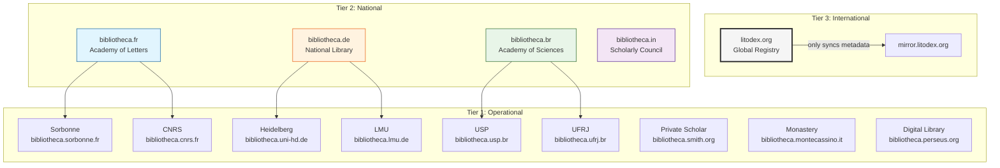
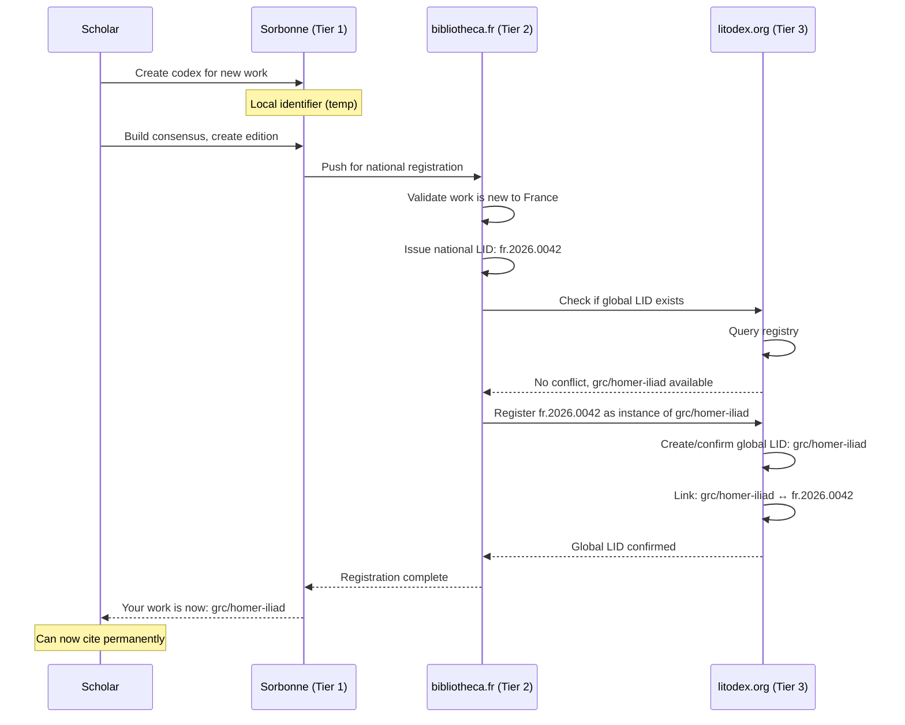

# Litodex — Version Control for Humanity's Texts

Litodex is a platform for version-controlled, verified, and collaborative management of literary and sacred texts. It provides permanent identifiers, scholarly workflows, and a foundation for applications like the Litogram typing practice app.

## Core Philosophy

- **One work = one codex** — not per edition, not per user
- **Stemmata = traditions** — multiple authoritative versions coexist as branches
- **No single master** — scholarship has no single source of truth
- **Manuscripts are first-class** — `ms/` stemmata alongside editions
- **Sources are sacred** — every change must be traceable to a verifiable source
- **Consensus-driven** — public editions emerge from community agreement, not maintainer fiat
- **Permanent identifiers** — every snapshot gets a citable LID
- **Lightweight markup** — Litogramma annotations make parsing trivial
- **Federated by design** — no central control, multiple sovereign nodes

## Core Terminology

| Git | Litodex (Formal) | Litodex Alias | When to Use |
|-----|------------------|---------------|-------------|
| **repository** | codex | (none) | `lit codex init`, `lit codex list` |
| **root branch** | radix | (none) | Special stemma with `meta.toml` |
| **branch** | stemma | `sm` | Any textual tradition |
| **tag** | versio | `ver` | Frozen snapshot with date |
| **commit** | actum | `act` | Recorded change |
| **log** | historia | `hist` | History of acts |
| **diff** | delta | `delta` | Difference (Δ) |
| **status** | status | `st` | Current state |
| **merge** | convergere | `con` | Combine proposals into a stemma |

## The Bibliotheca Federation

Litodex is not a single service but a **federation of sovereign nodes** called **bibliothecae** (singular: bibliotheca). Each bibliotheca is an independent server running the Litodex software, configured for its role in the scholarly ecosystem.

### The Three-Tier Hierarchy



### Tier Definitions

| Tier | Type | Acts Enabled? | Can Issue LIDs? | Primary Function |
|------|------|---------------|-----------------|------------------|
| 1 | Operational | ✅ YES | ❌ NO | Create content, build consensus |
| 2 | National | ❌ NO | ✅ YES | Validate, preserve, issue national LIDs |
| 3 | International | ❌ NO | ✅ YES | Sync, detect conflicts, confirm global LIDs |

#### Key Insight
**Tier 2 and Tier 3 run the exact same software** — just with different configurations and peer relationships. The only difference is what they peer with.

---

## Tier 1: Operational Bibliothecae

**Who:** Universities, research institutions, private scholars, monasteries, museums, digital libraries

**What they do:**
- Create and modify content (`act`, `prop`, `priv`)
- Host their own stemmata with full version control
- Build consensus within their community
- Push converged works to their national bibliotheca
- Can peer directly with other Tier 1 for collaboration

### Technical Capabilities
- Full read/write access to their own stemmata
- Can host both public and private works
- Responsible for their own authentication
- Must peer with their national bibliotheca (but can also peer with others)
- **Cannot issue LIDs** — must request them from Tier 2

### Example Workflow

```bash
# A scholar at Sorbonne creates work
$ lit codex init grc/homer-iliad \
  --bibliotheca=bibliotheca.sorbonne.fr

# Work lives locally at:
# https://bibliotheca.sorbonne.fr/grc/homer-iliad

# Build consensus, create edition
$ lit sm create prop/iliad-sorbonne-xkm
$ lit act -m "Initial text" --source="..."
# ... discussion, voting ...
$ lit converge prop/iliad-sorbonne-xkm --into=ed/iliad-sorbonne

# When ready, push to national level
$ lit push national --to=bibliotheca.fr
Pushing ed/iliad-sorbonne/20250304 to national bibliotheca...
Requesting LID from bibliotheca.fr...
```

---

## Tier 2: National Bibliothecae

**Who:** Academies of Letters/Sciences, National Libraries, equivalent scholarly bodies

**What they do:**
- **Receive** converged stemmata from Tier 1 institutions
- **Validate** that submissions meet national scholarly standards
- **Issue national LIDs** (e.g., `fr.2026.0042`)
- **Host** national editions for long-term preservation
- **Never create content directly** — only receive from Tier 1
- **Sync metadata** with the international bibliotheca

### Technical Capabilities
- **Acts are disabled** — no direct commits
- **LID issuance is enabled** — can create permanent identifiers
- **Sync with Tier 1** (institutional bibliothecae)
- **Sync with Tier 3** (international bibliotheca)
- Maintains provenance of all received works

### Configuration Example

```toml
# /etc/litodex/bibliotheca.fr.toml
[server]
name = "Bibliotheca Nationalis Franciae"
domain = "bibliotheca.fr"
tier = 2

[capabilities]
acts_enabled = false  # Cannot create content
lid_issuance = true    # Can issue national LIDs
sync_enabled = true    # Can sync with peers

[peers]
# Tier 1 institutions that feed into this national bibliotheca
tier1 = [
  "https://bibliotheca.sorbonne.fr",
  "https://bibliotheca.cnrs.fr",
  "https://bibliotheca.college-de-france.fr"
]

# Tier 3 peer (only one)
tier3 = "https://litodex.org"

[lid]
# National LID namespace
namespace = "fr"
pattern = "{namespace}.{year}.{sequential}"  # e.g., fr.2026.0001

[sync]
# Push metadata to Tier 3 immediately
push_to_tier3 = true
# Check for conflicts daily
conflict_check_interval = "24h"
```

### What a National Bibliotheca Stores

```bash
$ ls -la /var/lib/bibliotheca.fr/grc/
drwxr-xr-x  homer-iliad/
-rw-r--r--  provenance.toml

$ cat homer-iliad/provenance.toml
[work]
id = "grc/homer-iliad"
national_id = "fr.2026.0042"
global_lid = "grc/homer-iliad"  # Confirmed by Tier 3

[instances]
sorbonne-20250304 = {
  source = "bibliotheca.sorbonne.fr/grc/homer-iliad/ed/sorbonne/20250304",
  validated = "2026-03-05",
  validator = "Académie des Inscriptions et Belles-Lettres",
  validation_notes = "Meets French scholarly standards for critical editions"
}

cnrs-20250301 = {
  source = "bibliotheca.cnrs.fr/grc/homer-iliad/ed/cnrs/20250301",
  validated = "2026-03-02",
  validator = "Académie des Sciences",
  validation_notes = "Diplomatic transcription, apparatus complete"
}

[national_edition]
# The academy may choose to highlight certain versions
current = "sorbonne-20250304"
archive = ["cnrs-20250301"]
```

---

## Tier 3: International Bibliotheca (litodex.org)

**Who:** A lightweight coordinating body — the global registry

**What they do:**
- **Maintain the global LID registry** (which works exist, their canonical names)
- **Sync metadata** across all national bibliothecae
- **Detect identifier conflicts** when two nations use the same LID for different works
- **Never store content** — only metadata and pointers
- **Never exercise power** — conflicts are returned to the nations involved
- **Confirm global LIDs** after checking for conflicts

### Technical Capabilities
- **Acts are disabled** — no content, ever
- **LID issuance is enabled** — confirms global identifiers
- **Sync with all Tier 2** bibliothecae
- **Conflict detection** (automatic)
- **Conflict resolution** (human-mediated, never automatic)

### Configuration Example

```toml
# /etc/litodex/litodex.org.toml
[server]
name = "Litodex Internationalis"
domain = "litodex.org"
tier = 3

[capabilities]
acts_enabled = false     # Cannot create content
lid_issuance = true      # Can confirm global LIDs
sync_enabled = true      # Sync with all Tier 2

[peers]
# All national bibliothecae
tier2 = [
  "https://bibliotheca.fr",
  "https://bibliotheca.de",
  "https://bibliotheca.it",
  "https://bibliotheca.gr",
  "https://bibliotheca.br",
  "https://bibliotheca.in",
  "https://bibliotheca.cn",
  "https://bibliotheca.eg",
  "https://bibliotheca.il",
  # ... all others
]

[lid]
# Global namespace (no prefix)
namespace = "global"
pattern = "{lang}/{author}-{work}"  # e.g., grc/homer-iliad

[sync]
# Pull from all Tier 2 every hour
pull_interval = "1h"
# Immediately flag conflicts
conflict_detection = "immediate"
# Never resolve conflicts automatically
auto_resolve = false
```

### The Global Registry Data Model

```json
// What litodex.org stores per LID
GET https://litodex.org/registry/grc/homer-iliad

{
  "global_lid": "grc/homer-iliad",
  "canonical_name": "Homer, Iliad",
  "language": "grc",
  "registered": "2026-01-15T10:00:00Z",
  "last_updated": "2026-03-04T15:30:00Z",
  
  "national_instances": [
    {
      "nation": "fr",
      "national_lid": "fr.2026.0042",
      "bibliotheca": "https://bibliotheca.fr",
      "work_url": "https://bibliotheca.fr/grc/homer-iliad",
      "editions": [
        {
          "id": "sorbonne-20250304",
          "name": "Édition critique de l'Iliade",
          "url": "https://bibliotheca.sorbonne.fr/grc/homer-iliad/ed/sorbonne/20250304"
        }
      ]
    },
    {
      "nation": "de",
      "national_lid": "de.2026.0087",
      "bibliotheca": "https://bibliotheca.de",
      "work_url": "https://bibliotheca.de/grc/homer-iliad",
      "editions": [
        {
          "id": "hdbrw-20250215",
          "name": "Heidelberger Homer-Ausgabe",
          "url": "https://bibliotheca.uni-hd.de/grc/homer-iliad/ed/hdbrw/20250215"
        }
      ]
    }
  ],
  
  "global_consensus": null,  // Only if nations agree
  "conflict_status": "none"
}
```

---

## The LID Issuance Flow



---

## Conflict Detection and Resolution

The international bibliotheca's **only power** is to detect conflicts and notify the parties involved.

### The Conflict Detector

```python
# litodex.org's entire core logic (simplified)

class GlobalRegistry:
    def __init__(self):
        self.lids = {}  # global LID → list of national instances
        self.reservations = set()  # LIDs being checked
    
    def check_conflict(self, global_lid, requesting_nation):
        """Check if a global LID is available"""
        if global_lid in self.lids:
            # Already exists - return existing instances
            return {
                "status": "exists",
                "instances": self.lids[global_lid],
                "message": f"This LID is already registered. See existing instances above."
            }
        
        # Not yet registered - reserve it briefly
        self.reservations.add(global_lid)
        return {
            "status": "available",
            "reservation": "valid for 24h",
            "message": "LID available. Please complete registration within 24 hours."
        }
    
    def register(self, global_lid, national_instance):
        """Register a national instance under a global LID"""
        if global_lid not in self.lids:
            self.lids[global_lid] = []
        
        self.lids[global_lid].append(national_instance)
        
        # Notify all national bibliothecae of the new LID
        self.broadcast_update(global_lid)
        
        return {
            "status": "registered",
            "global_lid": global_lid,
            "message": f"Successfully registered. This LID now points to {len(self.lids[global_lid])} national instance(s)."
        }
```

### Real Conflict Example

```bash
# Two nations try to register the same LID simultaneously
$ litodex.org/logs/2026-03-04.log

10:32:15 [CONFLICT] Detected simultaneous reservation
  LID: "san/buddha-charita"
  
  Reservation 1: bibliotheca.in (India)
    Work: "Life of Buddha by Ashvaghosha"
    Evidence: "Critical edition based on Sanskrit manuscripts"
  
  Reservation 2: bibliotheca.cn (China)
    Work: "Buddhacarita (Chinese canon version)"
    Evidence: "Taisho Tripitaka edition with Chinese commentary"
  
  These appear to be different recensions of related but distinct texts.

10:32:16 [ACTION] Notified both parties
  To: bibliotheca.in, bibliotheca.cn
  Subject: LID conflict: san/buddha-charita
  
  "Both of you have reserved this LID for what appear to be
  different works. Please communicate and decide among yourselves:
  
  - One of you keeps the LID, the other chooses a different one
  - You agree to share the LID with clear attribution
  - You request hierarchical LIDs (e.g., san/buddha-charita/indian)
  
  litodex.org has no opinion. We await your consensus."

10:48:03 [RESOLUTION] Received from both parties
  "We have agreed:
   - bibliotheca.in will use san/buddha-charita for the Sanskrit version
   - bibliotheca.cn will use san/buddha-charita-chinese for the Chinese canon version
   - Both LIDs will cross-reference each other in metadata"
  
  Registry updated.
```

---

## Roles (Per Bibliotheca)

Each bibliotheca maintains its own roles independently. A scholar may be a curator at their university, a custos at the national level, and have no role internationally.

| Role | Latin | Responsibility | Level |
|------|-------|----------------|-------|
| **Curator** | *curator* | Maintains radix stemma (metadata) | Any |
| **Custos** | *custos* | Facilitates consensus for a public stemma | Any |

### Curator (at any level)

The curator maintains the **radix** — the root stemma containing only `meta.toml`.

```bash
# At institutional level
$ lit cur list --bibliotheca=bibliotheca.sorbonne.fr
Curatores for grc/homer-iliad:
  @smith (since 2026-01-15)
  @jones (since 2026-02-20)

# At national level (Tier 2, though acts disabled)
$ lit cur list --bibliotheca=bibliotheca.fr
Curatores for national metadata:
  @dupont (Académie des Inscriptions)
  @martin (Bibliothèque Nationale)
```

### Custos (at any level)

The **custos** serves the consensus within their bibliotheca.

```bash
$ lit cus list --bibliotheca=bibliotheca.uni-hd.de
Custodes for grc/homer-iliad:
  @schmidt → ed/iliad-heidelberg
  @weber → ms/venetus-a-diplomatic
```

---

## Repository Structure (Same at All Levels)

Every codex follows this pattern:

```
{lang}/{author}-{work}
```

Example: `grc/homer-iliad`

### Stemma Hierarchy

| Prefix | Latin | Purpose | Protection |
|--------|-------|---------|------------|
| `radix` | *radix* | Root stemma with `meta.toml` | 🔒 Curators only |
| `ed/` | *editio* | Published editions (consensus-based) | 🔒 Custos-facilitated |
| `ms/` | *manuscriptum* | Historical manuscript transcriptions | 🔒 Custos-facilitated |
| `prop/` | *propositum* | Proposals for changes (must include sources) | ❌ Anyone, but must cite sources |
| `priv/` | *privatus* | Personal workspace | ❌ Owner only |
| `collab/` | *collaboratio* | Group projects | 🔒 Team |
| `rev/` | *recensio* | Review stemmata | ⚠️ Temporary |
| `arch/` | *archivum* | Archived stemmata | 🔒 Read-only |

---

## The Source Requirement

**Every act in a `prop/` stemma must be traceable to a source.** This creates an auditable chain of evidence.

### Source Types

```toml
# Digital sources (automatically verifiable)
[source.type.digital]
url = "https://..."           # Source URL
hash = "sha256:abc123..."     # Content hash for verification
conversion_pipeline = "litogramma"  # The markup conversion used

# Print sources (require human mediation)
[source.type.print]
citation = "West, M.L. (1998). Homerus: Ilias. Vol. I. Stuttgart: Teubner. p. 47"
mediator = "@scholar"         # Who verified this source
verification_date = "2026-03-04"
note = "Personal examination of copy in Bodleian Library"

# Manuscript sources (physical or digital)
[source.type.manuscript]
identifier = "Venetus A"       # Common name
catalog = "Marc. Gr. Z. 454"   # Catalog number
library = "Biblioteca Nazionale Marciana, Venice"
folio = "47r"
line = "12"
image_url = "https://..."      # If digitized
```

---

## The Consensus Workflow (Tier 1)

### Phase 1: No Public Stemma Exists

```bash
$ lit sm list
grc/homer-iliad:
  radix
  ms/venetus-a
  ms/townley
  priv/smith-notes
  priv/jones-collation
  prop/iliad-oxford-xkm   (proposed Oxford edition)
```

### Phase 2: Create Proposal with Sources

```bash
$ lit prop create iliad-oxford-xkm \
  --target=ed/iliad-oxford \
  --source-type=digital \
  --source-url="https://archive.org/details/homeriilias00home" \
  --source-hash="sha256:def456..." \
  --message="Base text from Archive.org scan"
```

### Phase 3: Build Consensus

```bash
$ lit prop vote iliad-oxford-xkm --approve
$ lit prop comment iliad-oxford-xkm -m "Evidence attached"
$ lit consensus check iliad-oxford-xkm
Consensus: 78% approve (threshold met)
```

### Phase 4: Converge

```bash
$ lit converge prop/iliad-oxford-xkm --into=ed/iliad-oxford
Convergence complete. New versio: ed/iliad-oxford/20250304
```

### Phase 5: Push to National Level

```bash
$ lit push national --to=bibliotheca.fr
Pushing ed/iliad-oxford/20250304 for national registration...
Requesting LID from bibliotheca.fr...
Received national LID: fr.2026.0042
Global LID confirmed: grc/homer-iliad
```

---

## The `lit` CLI (Extended for Federation)

### Bibliotheca Management

```bash
# Configure your bibliotheca
$ lit config set bibliotheca https://bibliotheca.sorbonne.fr
$ lit config set national https://bibliotheca.fr

# Show federation status
$ lit federation status
Your bibliotheca: bibliotheca.sorbonne.fr (Tier 1)
National peer: bibliotheca.fr (Tier 2) - connected
International peer: litodex.org (Tier 3) - connected via national

# List all known bibliothecae
$ lit federation list
Tier 1 (operational):
  - bibliotheca.sorbonne.fr
  - bibliotheca.cnrs.fr
  - bibliotheca.uni-hd.de
  
Tier 2 (national):
  - bibliotheca.fr (peer)
  - bibliotheca.de
  - bibliotheca.it
  
Tier 3 (international):
  - litodex.org (connected)
```

### Pushing to National Level

```bash
# Push an edition for national registration
$ lit push national --stemma=ed/iliad-oxford --versio=20250304
Pushing to bibliotheca.fr...
Validation in progress...
✓ Meets French scholarly standards
✓ Sources verified (12/12)
✓ Consensus documented

Issued national LID: fr.2026.0042
Checking global registry...
Global LID confirmed: grc/homer-iliad

Your edition is now permanently citable as:
  https://bibliotheca.fr/grc/homer-iliad/ed/oxford/20250304
  Global LID: grc/homer-iliad
```

### Resolving LIDs

```bash
# Resolve a global LID
$ lit resolve grc/homer-iliad
Found 3 national instances:

1. France (fr.2026.0042)
   URL: https://bibliotheca.fr/grc/homer-iliad
   Editions: oxford-20250304, cnrs-20250301
   
2. Germany (de.2026.0087)
   URL: https://bibliotheca.de/grc/homer-iliad
   Editions: heidelberg-20250215, leipzig-20250120
   
3. Greece (gr.2026.0012)
   URL: https://bibliotheca.gr/grc/homer-iliad
   Editions: athens-academy-20250301

# Resolve a national LID  
$ lit resolve fr.2026.0042
National LID: fr.2026.0042
Issued by: bibliotheca.fr
Global LID: grc/homer-iliad
Editions:
  - https://bibliotheca.sorbonne.fr/grc/homer-iliad/ed/sorbonne/20250304
  - https://bibliotheca.cnrs.fr/grc/homer-iliad/ed/cnrs/20250301
```

---

## Integration with Litogram

Litodex provides the verified texts; Litogram provides the practice:

```typescript
// litogram.org backend
async function getText(lid: string) {
    // Resolve LID through federation
    const instances = await resolveLID(lid);
    
    // Prefer national instance or let user choose
    const selected = await selectInstance(instances);
    
    const { content, metadata, sources } = await fetch(selected.url);
    
    return {
        typing: strip_markup(content),      // 🌕 Full text
        memorizing: first_letters(content), // 🌗 First letters only
        reciting: blank_page(),              // 🌑 Blank page
        metadata,
        sources: formatCitation(sources),
        citation: `${lid} (via ${selected.nation})`
    };
}
```

---

## Why This Architecture?

### For Scholars
- Work at your institution with local authentication
- National validation ensures quality
- Global discovery through LIDs
- Complete provenance tracking

### For Institutions
- Full control over your scholarship
- No vendor lock-in — it's open source
- Brand recognition (your own bibliotheca)
- Teaching sandboxes without global pollution

### For Nations
- Cultural sovereignty respected
- Set your own validation standards
- Preserve national scholarly traditions
- Control what enters your bibliotheca

### For Humanity
- No single point of failure or control
- Multiple perspectives preserved
- Resilient network of scholarship
- Permanent, citable identifiers for all texts

---

## License

Litodex core is open source under the MIT License. Content licenses are determined by contributors at each bibliotheca, with source attribution preserved forever.

---

**One protocol. Sovereign nodes. Infinite texts. Every change traceable to its source.**

**[Get Started](#) | [Federation Protocol Spec](#) | [Run a Bibliotheca](#) | [Community](#)**
