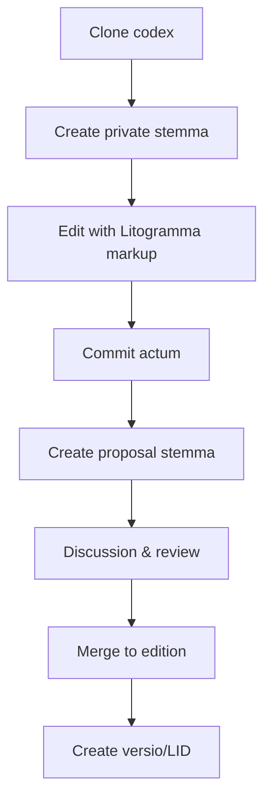

# Litodex — Version Control for Humanity's Texts

Litodex is a platform for version-controlled, verified, and collaborative management of literary and sacred texts. It provides permanent identifiers, scholarly workflows, and a foundation for applications like the Litogram typing practice app.

## Core Philosophy

- **One work = one codex** — not per edition, not per user
- **Stemmata = traditions** — multiple authoritative versions coexist as branches
- **No single master** — scholarship has no single source of truth
- **Manuscripts are first-class** — `ms/` stemmata alongside editions
- **Consensus-driven** — public editions emerge from community agreement, not maintainer fiat
- **Permanent identifiers** — every snapshot gets a citable LID
- **Lightweight markup** — Litogramma annotations make parsing trivial

## Core Terminology

| Git | Litodex (Formal) | Litodex Alias | When to Use |
|-----|------------------|---------------|-------------|
| **repository** | codex | (none) | `lit codex init`, `lit codex list` |
| **root branch** | radix | (none) | Special stemma with `meta.toml` |
| **branch** | stemma | `sm` | Any textual tradition |
| **tag** | versio | `ver` | Frozen snapshot with date |
| **commit** | actum | `act` | Recorded change |
| **log** | historia | `hist` | History of acts |
| **diff** | delta | `delta` | Difference (Δ) |
| **status** | status | `st` | Current state |

## Roles

| Role | Latin | Responsibility | Alias |
|------|-------|----------------|-------|
| **Curator** | *curator* | Maintains radix stemma (metadata) | `cur` |
| **Custos** | *custos* | Facilitates consensus for a public stemma | `cus` |

### Curator

The curator maintains the **radix** — the root stemma containing only `meta.toml`. This role is about preserving the work's identity, not controlling content.

```bash
$ lit cur list
Curatores for grc/homer-iliad:
  @smith (since 2026-01-15)
  @jones (since 2026-02-20)

$ lit cur add @patel
Added @patel as curator. They can now maintain radix.
```

### Custos

The **custos** (plural: **custodes**) does not decide — they **serve the consensus**. Their role is to facilitate discussion, monitor proposals, and execute merges when the community reaches agreement.

```bash
$ lit cus list
Custodes for grc/homer-iliad:
  @oxford_editor   → ed/iliad-oxford
  @teubner_editor  → ed/iliad-teubner
  @manuscript_scholar → ms/venetus-a

$ lit cus add @cambridge_editor --stemma=ed/iliad-cambridge
Added @cambridge_editor as custos of ed/iliad-cambridge.
```

A custos:
- Does not have unilateral merge authority
- Cannot override community consensus
- Facilitates discussion and voting
- Executes merges only when consensus thresholds are met

## Repository Structure

Every codex follows this pattern:

```
{lang}/{author}-{work}
```

Example: `grc/homer-iliad`

### Stemma Hierarchy

| Prefix | Latin | Purpose | Protection |
|--------|-------|---------|------------|
| `radix` | *radix* | Root stemma with `meta.toml` | 🔒 Curators only |
| `ed/` | *editio* | Published editions (consensus-based) | 🔒 Custos-facilitated |
| `ms/` | *manuscriptum* | Historical manuscript transcriptions | 🔒 Custos-facilitated |
| `prop/` | *propositum* | Proposals for changes | ❌ Anyone |
| `priv/` | *privatus* | Personal workspace | ❌ Owner only |
| `collab/` | *collaboratio* | Group projects | 🔒 Team |
| `rev/` | *recensio* | Review stemmata | ⚠️ Temporary |
| `arch/` | *archivum* | Archived stemmata | 🔒 Read-only |

### The Radix Stemma

Every codex has a `radix` stemma containing a single `meta.toml` file:

```toml
[work]
id = "grc/homer-iliad"
title = "Iliad"
author = "Homer"
language = "grc"
type = "poetry"

# Optional
period = "8th century BCE"
description = "Ancient Greek epic poem"
license = "public-domain"
```

The radix is:
- Created at initialization, never deleted
- Only editable by curators
- Automatically merged into all other stemmata when changed
- The source of truth for work identity

```bash
$ lit sm show radix
Stemma: radix (PROTECTED)
Type: root stemma
Curators: @smith, @jones
Contains: meta.toml only
Acts: 3 (last: a1b2c3d "Updated description")
Auto-merges to: all stemmata
```

## Public Stemmata: `ed/` and `ms/`

### Definition

| Stemma | Purpose | Example |
|--------|---------|---------|
| `ed/` | Published editions representing scholarly consensus | `ed/iliad-oxford` |
| `ms/` | Diplomatic transcriptions of historical manuscripts | `ms/venetus-a` |

Both follow the **same consensus-based workflow**. Neither exists until the community creates them through proposals.

### The Proposal System

Proposals use random 3-letter IDs to avoid implying priority or order:

```
prop/{target-stemma-name}-{random-id}
```

Examples:
- `prop/iliad-oxford-xkm`
- `prop/iliad-oxford-jqr`
- `prop/venetus-a-plm`

The random ID (consonant-vowel-consonant) ensures no proposal appears "first" or "more important."

## The Consensus Workflow

### Phase 1: No Public Stemma Exists

Initially, only `radix`, manuscripts (`ms/`), and personal stemmata exist:

```bash
$ lit sm list
grc/homer-iliad:
  radix
  ms/venetus-a
  ms/townley
  priv/smith-notes
  priv/jones-collation
  prop/iliad-oxford-xkm   (proposed Oxford edition)
  prop/iliad-oxford-jqr   (another proposal)
  prop/iliad-oxford-plm   (yet another)
```

### Phase 2: Proposals Are Created

Scholars create proposal stemmata for changes they want to see:

```bash
# Scholar creates a proposal for a new Oxford edition
$ lit sm create prop/iliad-oxford-xkm --from=ms/venetus-a
$ vim iliad.txt
$ lit act -m "Base text from Venetus A with corrections"
$ lit push origin prop/iliad-oxford-xkm

# Open for discussion
$ lit prop open prop/iliad-oxford-xkm --target=ed/iliad-oxford
Proposal opened. Target: ed/iliad-oxford (not yet created)
```

### Phase 3: Community Discussion and Voting

Scholars discuss, provide evidence, and vote:

```bash
$ lit prop vote prop/iliad-oxford-xkm --approve --reason="Matches manuscript evidence"
$ lit prop comment prop/iliad-oxford-xkm -m "See attached image of Venetus A folio 47r"

$ lit prop vote prop/iliad-oxford-jqr --reject --reason="Needs stronger evidence"
```

The custos monitors consensus:

```bash
$ lit consensus check prop/iliad-oxford-xkm
Proposal: prop/iliad-oxford-xkm
Target: ed/iliad-oxford
Consensus: 78% approve (exceeds 70% threshold)
Votes: 14 approve, 3 reject, 2 abstain
Blocking objections: 1 (resolved)
Ready to merge.
```

### Phase 4: Custos Executes Consensus

When consensus is reached, the custos merges:

```bash
$ lit prop merge prop/iliad-oxford-xkm
Merging prop/iliad-oxford-xkm into ed/iliad-oxford
Consensus confirmed: 78% approve (exceeds 70% threshold)
Creating ed/iliad-oxford...
Merged.

# A versio is automatically created with date suffix
$ lit ver list
ed/iliad-oxford/20250304   (first edition, includes xkm changes)
```

The new public stemma now exists.

### Phase 5: Subsequent Corrections

Later, another scholar proposes a correction:

```bash
$ lit sm create prop/iliad-oxford-tyr --from=ed/iliad-oxford/20250304
$ vim iliad.txt  # fix line 102
$ lit act -m "Corrected accent in line 102"
$ lit prop open prop/iliad-oxford-tyr --target=ed/iliad-oxford

# Discussion, voting, consensus...
$ lit prop merge prop/iliad-oxford-tyr
Merged. New versio: ed/iliad-oxford/20250315
```

Each merge creates a new versio with the date of merge.

### The Versio Timeline

```bash
$ lit ver list --stemma=ed/iliad-oxford
ed/iliad-oxford/20250304   (initial consensus edition)
ed/iliad-oxford/20250315   (correction to line 102)
ed/iliad-oxford/20250401   (added apparatus from jqr proposal)
ed/iliad-oxford/20250420   (further corrections)
```

Each versio is a frozen snapshot of community consensus at that point in time, permanently citable.

## The Custos Dashboard

```bash
$ lit custos dashboard --stemma=ed/iliad-oxford
Custos dashboard for ed/iliad-oxford

Current version: ed/iliad-oxford/20250401

Open proposals:
  prop/iliad-oxford-tyr (92% approve) → ready to merge
  prop/iliad-oxford-wlm (63% approve) → needs discussion
  prop/iliad-oxford-zab (41% approve) → weak support

Recent merges:
  2025-04-01: merged prop/iliad-oxford-jqr (apparatus)
  2025-03-15: merged prop/iliad-oxford-tyr (line 102)
  2025-03-04: created ed/iliad-oxford from 3 proposals

Consensus threshold: 70% approve, <10% blocking反对
```

## The Radix Auto-Merge

When curators update the radix:

```bash
$ lit sm checkout radix
$ vim meta.toml
$ lit act -m "Updated license to CC-BY"

# Automatically merges to ALL stemmata
$ lit act show a1b2c3d
Actum: a1b2c3d
Stemma: radix
Message: "Updated license to CC-BY"

Auto-merged to:
  ✓ ed/iliad-oxford (merge act e4f5g6h)
  ✓ ed/iliad-teubner (merge act i7j8k9l)
  ✓ ms/venetus-a (merge act m0n1o2p)
  ✓ priv/smith-experimental (merge act q3r4s5t)
  ✓ ...
```

Metadata flows to all traditions automatically.

## Permanent Identifiers (LIDs)

Every versio gets a permanent, citable Litodex Identifier:

```
{lang}/{author}/{work}/{stemma}/{date}
```

Example: `grc/homer/iliad/ed/oxford-1920/20250304`

Resolution:
```
https://lid.litodex.org/grc/homer/iliad/ed/oxford-1920/20250304
```

LIDs are stored as Git tags in `refs/tags/lid/` and are immutable.

## The `lit` CLI

### Codex Operations

```bash
# Initialize a new codex
$ lit codex init grc/homer-iliad --author="Homer" --title="Iliad"
Created codex grc/homer-iliad
  radix stemma initialized with meta.toml

# List all codices
$ lit codex list

# Show codex info
$ lit codex show
```

### Daily Work

```bash
# List stemmata
$ lit sm list
stemmata in grc/homer-iliad:
  radix
  ms/venetus-a
  priv/smith-experimental
  prop/iliad-oxford-xkm

# Create private stemma
$ lit sm create priv/smith-experimental --from=ms/venetus-a

# Switch stemma
$ lit sm checkout priv/smith-experimental

# Check status
$ lit st
Stemma: priv/smith-experimental
Status: 1 unstaged change

# Commit changes
$ lit act -m "Collated lines 1-50"

# View history
$ lit hist
a1b2c3d 2026-03-04 "Collated lines 1-50"
e4f5g6h 2026-03-03 "Initial copy from Venetus A"
```

### Proposal Workflow

```bash
# Create a proposal
$ lit sm create prop/iliad-oxford-xkm --from=priv/smith-experimental
$ lit prop open prop/iliad-oxford-xkm --target=ed/iliad-oxford

# Vote on proposals
$ lit prop vote prop/iliad-oxford-xkm --approve
$ lit prop comment prop/iliad-oxford-xkm -m "Evidence attached"

# Check consensus
$ lit consensus check prop/iliad-oxford-xkm

# Merge (custos only)
$ lit prop merge prop/iliad-oxford-xkm
```

### Working with Versiones

```bash
# List versiones
$ lit ver list --stemma=ed/iliad-oxford
ed/iliad-oxford/20250304
ed/iliad-oxford/20250315

# Show specific versio
$ lit show grc/homer/iliad/ed/iliad-oxford/20250304 --verse=1.47

# Compare versiones
$ lit delta ed/iliad-oxford/20250304 ed/iliad-oxford/20250315 --verse=1.47

# Cite versio
$ lit cite grc/homer/iliad/ed/iliad-oxford/20250304 --format=bibtex
```

### Role Management

```bash
# List roles
$ lit role list
Codex: grc/homer-iliad

Curatores (radix):
  @smith
  @jones

Custodes (public stemmata):
  @oxford_editor   → ed/iliad-oxford
  @teubner_editor  → ed/iliad-teubner
  @manuscript_scholar → ms/venetus-a

# Add curator
$ lit cur add @patel

# Add custos
$ lit cus add @cambridge_editor --stemma=ed/iliad-cambridge
```

### Stemma Management

```bash
# List stemmata with details
$ lit sm list --verbose
  ed/oxford-1920 (protected, 127 acta)
  priv/smith-experimental (your workspace, 3 acta)
  prop/smith-1.47-correction (open proposal)

# Archive old stemmata
$ lit sm archive --older-than=1y --prefix=priv/

# Clean up merged proposals
$ lit sm prune --merged
```

## Architecture

### Storage
- **One Git repository per codex**
- All stemmata (editions, manuscripts, personal) in same repo
- `radix` stemma for work identity
- LIDs stored as Git tags in `refs/tags/lid/` namespace

### Indexing (Optional, for performance)
- SQLite index for fast semantic queries
- Rebuilt from Git on demand
- Stores reference → line → word mappings

### Parsing
- Litogramma markup makes parsing trivial
- No heuristics — users provide structure via `// ref`
- Word boundaries via Unicode segmentation

### Resolution Service
- `lid.litodex.org/{lid}` → permanent redirects
- Backed by Git tags, no database needed
- Returns HTTP 302 to canonical URL

## Workflows

### For Scholars



### For Students
1. Professor shares LID: `grc/homer/iliad/ed/oxford-1920/20250101`
2. Student enters LID → exact text
3. Practice on Litogram
4. All using same verified version

### For Publishers
1. Prepare critical edition
2. Upload to Litodex as `ed/publisher-year`
3. Create versio/LID
4. Include LID in print edition
5. Readers access digital version

## Branch Protection Rules

| Prefix | Protected? | Who Can Push |
|--------|------------|--------------|
| `radix` | ✅ Yes | Repository owners only |
| `ed/` | ✅ Yes | Edition maintainers |
| `ms/` | ✅ Yes | Manuscript curators |
| `collab/` | ⚠️ Limited | Team members |
| `priv/` | ❌ No | Owner only |
| `prop/` | ❌ No | Anyone (creates discussion) |

## Integration with Litogram

Litodex provides the verified texts; Litogram provides the practice:

```typescript
// litogram.org backend
async function getText(lid: string) {
    const { content, metadata } = await fetch(`https://api.litodex.org/v1/resolve/${lid}`);
    return {
        typing: strip_markup(content),      // 🌕 Full text
        memorizing: first_letters(content), // 🌗 First letters only
        reciting: blank_page(),              // 🌑 Blank page
        metadata
    };
}
```

## Why Litodex?

- **For scholars**: Permanently citable versiones, consensus-driven workflow, manuscript tracking
- **For students**: Verified texts, Litogram integration, citation-ready
- **For institutions**: Hosted collections, private repositories, custom branding
- **For humanity**: Preservation of cultural heritage with cryptographic provenance

## License

Litodex core is open source under the MIT License. Content licenses are determined by contributors.

---

**One platform. One community. Infinite texts.**
