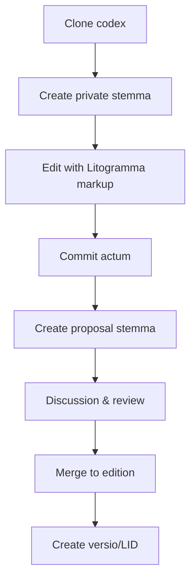

# Litodex — Version Control for Humanity's Texts

Litodex is a platform for version-controlled, verified, and collaborative management of literary and sacred texts. It provides permanent identifiers, scholarly workflows, and a foundation for applications like the Litogram typing practice app.

## Core Philosophy

- **One work = one repository** — not per edition, not per user
- **Editions = stemmata** — multiple authoritative versions coexist
- **No single master** — scholarship has no single source of truth
- **Manuscripts are first-class** — `ms/` stemmata alongside editions
- **Permanent identifiers** — every snapshot gets a citable LID
- **Lightweight markup** — Litogramma annotations make parsing trivial

## Core Terminology

| Git | Litodex (Formal) | Litodex Alias | When to Use |
|-----|------------------|---------------|-------------|
| **repository** | codex | (none) | `lit codex init`, `lit codex list` |
| **branch** | stemma | `sm` | Daily work: `lit sm list`, `lit sm checkout` |
| **tag** | versio | `ver` | `lit ver create`, `lit ver list` |
| **commit** | actum | `act` | `lit act -m "message"`, `lit act show` |
| **log** | historia | `hist` | `lit hist`, `lit hist --stem=ed/oxford-1920` |
| **diff** | delta | (none) | `lit delta ver/1.0.0 ver/1.0.1` |
| **status** | status | `st` | `lit st` |

### Why This Pattern

- **Full words** for rare commands (`codex`, `delta`) — no alias needed
- **Short aliases** for daily commands (`sm`, `ver`, `act`, `hist`, `st`) — speed where it matters
- **Aliases are mnemonic** — `sm` = stemma, `ver` = versio, `act` = actum, `hist` = historia, `st` = status

## Repository Structure

Every codex follows this pattern:

```
{lang}/{author}-{work}
```

Example: `grc/homer-iliad`

### Stemma Hierarchy

| Prefix | Latin | Purpose | Protection |
|--------|-------|---------|------------|
| `radix` | *radix* | Work metadata (single file) | 🔒 Owner only |
| `ed/` | *editio* | Public authoritative editions | 🔒 Maintainers |
| `ms/` | *manuscriptum* | Source manuscripts | 🔒 Curators |
| `collab/` | *collaboratio* | Group projects | 🔒 Team |
| `priv/` | *privatus* | Personal workspace | ❌ Owner |
| `prop/` | *propositum* | Proposed changes | ❌ Anyone |
| `rev/` | *recensio* | Review stemmata | ⚠️ Temporary |
| `arch/` | *archivum* | Archived stemmata | 🔒 Read-only |

### The Radix Stemma

Every codex has a `radix` stemma containing a single `meta.toml` file:

```toml
[work]
id = "grc/homer-iliad"
title = "Iliad"
author = "Homer"
language = "grc"
type = "poetry"

# Optional
period = "8th century BCE"
description = "Ancient Greek epic poem"
license = "public-domain"
```

This stemma is created at initialization and never deleted. It establishes the work's identity independent of any content stemma.

## Litogramma Markup

Texts use lightweight, human-readable annotations:

```
## Venetus A manuscript

μῆνιν ἄειδε θεὰ Πηληϊάδεω Ἀχιλῆος οὐλομένην,   // 1.1
ἣ μυρί᾽ Ἀχαιοῖς ἄλγε᾽ ἔθηκε,                    // 1.2
πολλὰς δ᾽ ἰφθίμους ψυχὰς Ἄϊδι προΐαψεν         // 1.3
```

- `##` — Headers (metadata, section breaks)
- `// ref` — Line-level canonical references
- Blank lines — Paragraph breaks

This makes parsing trivial and eliminates heuristics.

## Permanent Identifiers (LIDs)

Every important snapshot gets a **Litodex Identifier** — a permanent, citable URL.

### Format

```
{lang}/{author}/{work}/{stemma}/{date}
```

Example: `grc/homer/iliad/ed/oxford-1920/20250101`

### Resolution

```
https://lid.litodex.org/grc/homer/iliad/ed/oxford-1920/20250101
```

Redirects to the exact actum snapshot. LIDs are stored as Git tags:

```
refs/tags/lid/grc/homer/iliad/ed/oxford-1920/20250101
```

### Creating a LID

```bash
$ lit versio create --date=2025-01-01
LID: grc/homer/iliad/ed/oxford-1920/20250101
Permanent snapshot created.
```

## The `lit` CLI

### Codex Operations (Rare)

```bash
# Initialize a new codex
$ lit codex init grc/homer-iliad --author="Homer" --title="Iliad"

# List all codices
$ lit codex list

# Show codex info
$ lit codex show
```

### Daily Work (With Aliases)

```bash
# List stemmata
$ lit sm list
stemmata in grc/homer-iliad:
  ed/oxford-1920 (protected)
  ed/teubner-1898 (protected)
  ms/venetus-a (protected)
  priv/smith-experimental

# Create new stemma
$ lit sm create priv/smith-experimental --from=ed/oxford-1920

# Switch stemma
$ lit sm checkout priv/smith-experimental

# Check status
$ lit st
Stemma: priv/smith-experimental
Status: 1 unstaged change

# Commit changes
$ lit act -m "Correxi errorem in linea 47"

# View history
$ lit hist
a1b2c3d 2026-03-04 "Correxi errorem in linea 47"
e4f5g6h 2026-03-03 "Added apparatus to Book 1"

# Compare versions
$ lit delta ver/1.0.0 ver/1.0.1 --verse=1.47
Δ at line 47:
  ver/1.0.0: Ἀχιλῆος
  ver/1.0.1: Ἀχιλλέως

# Create a versio (frozen snapshot)
$ lit ver create ver/1.0.0
```

### Proposing Changes

```bash
# Create proposal stemma
$ lit sm create prop/smith-1.47-correction --from=priv/smith-experimental
$ lit push origin prop/smith-1.47-correction

# Request merge
$ lit request-merge prop/smith-1.47-correction --into=ed/oxford-1920
```

### Working with LIDs

```bash
# List versiones
$ lit ver list
grc/homer/iliad/ed/oxford-1920/20250101
grc/homer/iliad/ed/oxford-1920/20250315

# Show specific versio
$ lit show grc/homer/iliad/ed/oxford-1920/20250101 --verse=1.47

# Cite versio
$ lit cite grc/homer/iliad/ed/oxford-1920/20250101 --format=bibtex
```

### Metadata

```bash
# View work metadata
$ lit meta
Codex: grc/homer-iliad
Title: Iliad
Author: Homer
Language: grc (Ancient Greek)
Type: poetry

# Edit (requires special permission)
$ lit meta edit --description="Updated description"
```

### Stemma Management

```bash
# List stemmata with details
$ lit sm list --verbose
  ed/oxford-1920 (protected, 127 acta)
  priv/smith-experimental (your workspace, 3 acta)
  prop/smith-1.47-correction (open proposal)

# Archive old stemmata
$ lit sm archive --older-than=1y --prefix=priv/

# Clean up merged proposals
$ lit sm prune --merged
```

## Architecture

### Storage
- **One Git repository per codex**
- All stemmata (editions, manuscripts, personal) in same repo
- `radix` stemma for work identity
- LIDs stored as Git tags in `refs/tags/lid/` namespace

### Indexing (Optional, for performance)
- SQLite index for fast semantic queries
- Rebuilt from Git on demand
- Stores reference → line → word mappings

### Parsing
- Litogramma markup makes parsing trivial
- No heuristics — users provide structure via `// ref`
- Word boundaries via Unicode segmentation

### Resolution Service
- `lid.litodex.org/{lid}` → permanent redirects
- Backed by Git tags, no database needed
- Returns HTTP 302 to canonical URL

## Workflows

### For Scholars



### For Students
1. Professor shares LID: `grc/homer/iliad/ed/oxford-1920/20250101`
2. Student enters LID → exact text
3. Practice on Litogram
4. All using same verified version

### For Publishers
1. Prepare critical edition
2. Upload to Litodex as `ed/publisher-year`
3. Create versio/LID
4. Include LID in print edition
5. Readers access digital version

## Branch Protection Rules

| Prefix | Protected? | Who Can Push |
|--------|------------|--------------|
| `radix` | ✅ Yes | Repository owners only |
| `ed/` | ✅ Yes | Edition maintainers |
| `ms/` | ✅ Yes | Manuscript curators |
| `collab/` | ⚠️ Limited | Team members |
| `priv/` | ❌ No | Owner only |
| `prop/` | ❌ No | Anyone (creates discussion) |

## Integration with Litogram

Litodex provides the verified texts; Litogram provides the practice:

```typescript
// litogram.org backend
async function getText(lid: string) {
    const { content, metadata } = await fetch(`https://api.litodex.org/v1/resolve/${lid}`);
    return {
        typing: strip_markup(content),      // 🌕 Full text
        memorizing: first_letters(content), // 🌗 First letters only
        reciting: blank_page(),              // 🌑 Blank page
        metadata
    };
}
```

## Why Litodex?

- **For scholars**: Permanently citable versiones, collaborative workflows, manuscript tracking
- **For students**: Verified texts, Litogram integration, citation-ready
- **For institutions**: Hosted collections, private repositories, custom branding
- **For humanity**: Preservation of cultural heritage with cryptographic provenance

## License

Litodex core is open source under the MIT License. Content licenses are determined by contributors.

---

**One platform. One community. Infinite texts.**
